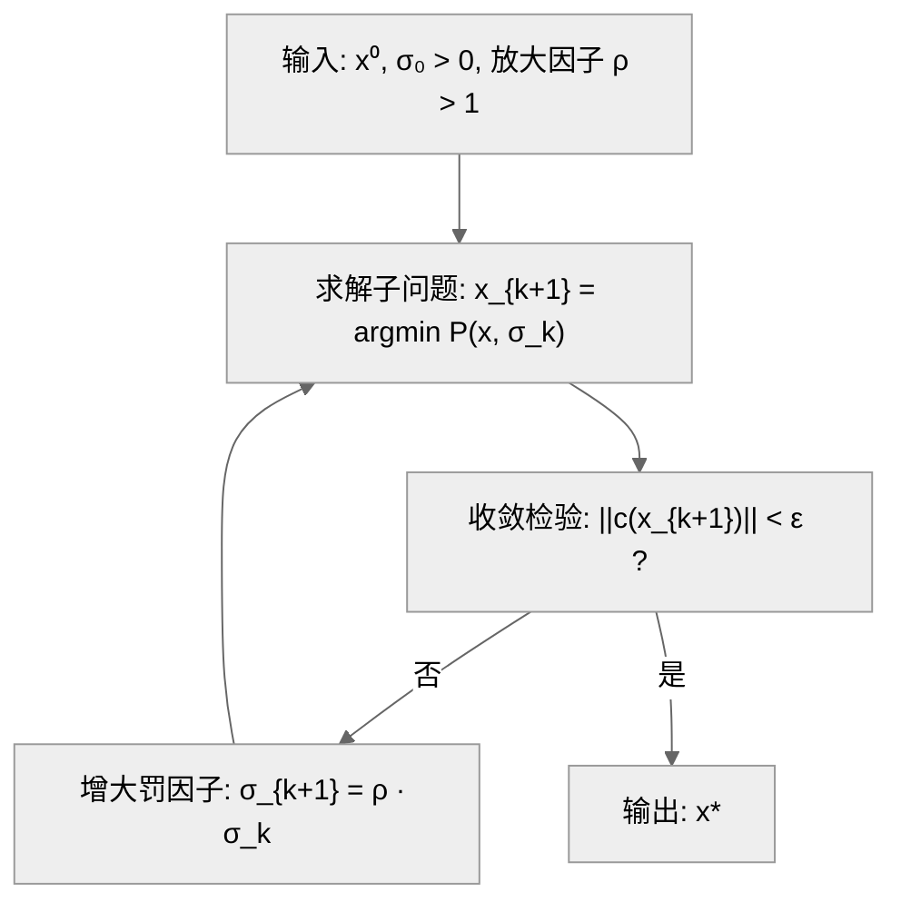
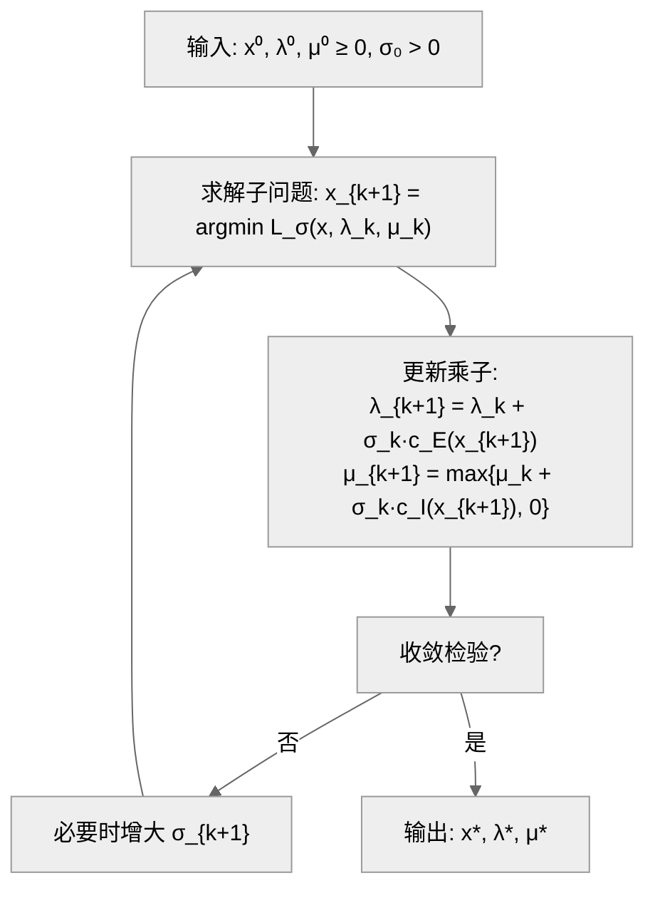

> http://faculty.bicmr.pku.edu.cn/~wenzw/optbook.html

# 最优性理论：
## 对偶问题：

### 1. 原问题

$$\min_{x \in \mathbb{R}^n} f(x) \quad \text{s.t.} \quad c_i(x) \leq 0,; i=1,\ldots,m; \quad h_j(x) = 0,; j=1,\ldots,l$$
### 2. 拉格朗日函数

引入乘子 $\lambda \in \mathbb{R}^m$（对应不等式）和 $\mu \in \mathbb{R}^l$（对应等式）：

$$L(x, \lambda, \mu) = f(x) + \sum_{i=1}^{m} \lambda_i c_i(x) + \sum_{j=1}^{l} \mu_j h_j(x)$$

**作用**：将约束"融入"目标函数，把约束优化转化为无约束形式分析。
### 3. 对偶函数

$$g(\lambda, \mu) = \inf_{x} L(x, \lambda, \mu)$$

**性质**：

- $g$ 是**凹函数**（无论原问题是否凸）$$g(\lambda) = \inf_{x} L(x, \lambda)$$
	- 每个 $x$ 给出一条关于 $\lambda$ 的直线
	- 有无穷多个 $x$，就有无穷多条直线
	- **在每个 $\lambda$ 处，选这些直线中最低的那个点**
	- 把这些最低点连起来，就是"下包络"
	- **纺射函数的逐点下包络是凹的** 
		- **对偶问题 $max⁡g(λ,μ)$ 是凸优化问题**

- 可能取值 $-\infty$（当下确界不存在时）


### 4. 对偶问题

$$\max_{\lambda, \mu} ; g(\lambda, \mu) \quad \text{s.t.} \quad \lambda \geq 0$$

|原问题|对偶问题|
|:-:|:-:|
|$\min$|$\max$|
|变量 $x$|变量 $(\lambda, \mu)$|
|最优值 $p^*$|最优值 $d^*$|

---

### 5. 弱对偶与强对偶

**弱对偶**（总是成立）： $$d^* \leq p^*$$

**对偶间隙**：$p^* - d^*$

**强对偶**（$d^* = p^*$）成立条件：

- **Slater条件**：原问题是凸问题，且存在严格可行点（$c_i(x) < 0$）
- 其他约束规范（如LICQ等）

### 7. 核心要点

|概念|要点|
|:--|:--|
|**为何引入对偶**|提供下界、简化求解、揭示结构|
|**$\lambda \geq 0$ 的原因**|保证对偶函数不取 $-\infty$，且违反约束时受"惩罚"|
|**对偶函数凹性**|是逐点下确界，下确界保持凹性|
|**强对偶意义**|可通过解对偶问题得到原问题最优值|

---

**一句话**：拉格朗日对偶通过引入乘子将约束松弛到目标中，对偶函数给出原问题的下界，强对偶成立时这个下界恰好达到最优值。
# 无约束优化问题 ：

## 线搜索方法：

迭代格式：$x_{k+1} = x_k + \alpha_k d_k$，其中 $d_k$ 满足 $\nabla f(x_k)^T d_k < 0$

---

### 一、单调线搜索（每步函数值必须下降）

|准则|公式|特点|
|:--|:--|:--|
|**Armijo**|$f(x_k + \alpha d_k) \leq f(x_k) + c_1 \alpha \nabla f(x_k)^T d_k$|只有下界，步长可能过大|
|**Goldstein**|Armijo + $f(x_k + \alpha d_k) \geq f(x_k) + (1-c) \alpha \nabla f(x_k)^T d_k$|上下界夹逼，但可能错过极小点|
|**Wolfe**|Armijo + $\nabla f(x_k + \alpha d_k)^T d_k \geq c_2 \nabla f(x_k)^T d_k$|曲率条件，保证步长不太小，最常用|

参数：$c_1 \in (0,1)$（常取 $10^{-3}$），$c_2 \in (c_1, 1)$（常取 $0.9$）

- [x] #question wolfe是不是就是梯度要减小？ ✅ 2025-12-05
	- 绝对值变小！
---

### 二、非单调线搜索（允许函数值偶尔上升）

|准则|公式|特点|
|:--|:--|:--|
|**Grippo**|$f(x_{k+1}) \leq \max_{0 \leq j \leq \min{k,M}} f(x_{k-j}) + c_1 \alpha \nabla f(x_k)^T d_k$|比前 $M+1$ 步最大值下降即可|
|**Zhang-Hager**|$f(x_{k+1}) \leq C_k + c_1 \alpha \nabla f(x_k)^T d_k$|$C_k$ 是历史函数值的加权平均|

---

### 三、算法
#### Armijo 回退算法

```
输入：初始步长 α̂，缩减因子 γ ∈ (0,1)，参数 c ∈ (0,1)
α ← α̂
while f(xₖ + αdₖ) > f(xₖ) + c·α·∇f(xₖ)ᵀdₖ do
    α ← γα
end while
输出：αₖ = α
```

#### 回退法 vs 插值法

**回退法**：步长不满足条件时，简单地乘以缩减因子 $\alpha \leftarrow \gamma \alpha$，效率较低。

**插值法**：利用已有信息构造多项式，求极小点作为新步长。

---

####  二次插值法

已知 $\phi(\alpha) = f(x_k + \alpha d_k)$，利用三个条件：

$$\phi(0), \quad \phi'(0) = \nabla f(x_k)^T d_k, \quad \phi(\hat{\alpha}_0)$$

构造二次多项式 $p_2(\alpha) = a\alpha^2 + b\alpha + c$，满足：

$$p_2(0) = \phi(0), \quad p_2'(0) = \phi'(0), \quad p_2(\hat{\alpha}_0) = \phi(\hat{\alpha}_0)$$

求得极小点：

$$\hat{\alpha}_1 = -\frac{\phi'(0) \cdot \hat{\alpha}_0^2}{2[\phi(\hat{\alpha}_0) - \phi(0) - \phi'(0)\hat{\alpha}_0]}$$

若 $\hat{\alpha}_1$ 仍不满足 Armijo 条件，可继续插值。

---

#### 五、对比

```
                   单调性    步长控制    适用场景
─────────────────────────────────────────────────
Armijo             单调      仅下界      简单实用
Goldstein          单调      上下界      一般优化
Wolfe              单调      曲率条件    拟牛顿法
Grippo/Zhang-Hager 非单调    允许波动    加速收敛、跳出局部
```

### 代码：
``` python fold
"""线搜索准则对比实现"""
import numpy as np
import matplotlib.pyplot as plt

# ============ 测试函数：二次函数 (更容易收敛) ============
def f(x):
    return 0.5 * (10 * x[0]**2 + x[1]**2)  # 条件数为10的椭圆

def grad_f(x):
    return np.array([10 * x[0], x[1]])

# ============ 线搜索准则 ============
def armijo_backtrack(f, grad_f, x, d, alpha=1.0, c1=1e-4, gamma=0.5):
    """Armijo 回退法"""
    fx, gx = f(x), grad_f(x)
    while f(x + alpha * d) > fx + c1 * alpha * gx @ d:
        alpha *= gamma
    return alpha

def armijo_interp(f, grad_f, x, d, alpha=1.0, c1=1e-4):
    """Armijo 插值法"""
    fx, gx = f(x), grad_f(x)
    phi0, dphi0 = fx, gx @ d
    
    if f(x + alpha * d) <= fx + c1 * alpha * dphi0:
        return alpha
    
    # 二次插值
    phi_alpha = f(x + alpha * d)
    alpha_new = -dphi0 * alpha**2 / (2 * (phi_alpha - phi0 - dphi0 * alpha))
    alpha_new = max(0.1 * alpha, min(alpha_new, 0.9 * alpha))  # 安全保护
    
    while f(x + alpha_new * d) > fx + c1 * alpha_new * dphi0:
        alpha_new *= 0.5
    return alpha_new

def goldstein(f, grad_f, x, d, alpha=1.0, c=0.2, rho=2.0):
    """Goldstein 准则"""
    fx, gx = f(x), grad_f(x)
    slope = gx @ d
    
    a, b = 0, np.inf
    for _ in range(50):
        fx_new = f(x + alpha * d)
        if fx_new > fx + c * alpha * slope:  # 上界不满足
            b = alpha
            alpha = (a + b) / 2
        elif fx_new < fx + (1 - c) * alpha * slope:  # 下界不满足
            a = alpha
            alpha = 2 * alpha if b == np.inf else (a + b) / 2
        else:
            break
    return alpha

def wolfe(f, grad_f, x, d, alpha=1.0, c1=1e-4, c2=0.9):
    """Wolfe 准则（简化实现）"""
    fx, gx = f(x), grad_f(x)
    slope = gx @ d
    
    a, b = 0, np.inf
    for _ in range(50):
        fx_new = f(x + alpha * d)
        if fx_new > fx + c1 * alpha * slope:  # Armijo 不满足
            b = alpha
            alpha = (a + b) / 2
        elif grad_f(x + alpha * d) @ d < c2 * slope:  # 曲率条件不满足
            a = alpha
            alpha = 2 * alpha if b == np.inf else (a + b) / 2
        else:
            break
    return alpha

def grippo(f, grad_f, x, d, f_hist, alpha=1.0, c1=1e-4, gamma=0.5, M=5):
    """Grippo 非单调准则"""
    gx = grad_f(x)
    f_max = max(f_hist[-min(len(f_hist), M+1):])
    
    while f(x + alpha * d) > f_max + c1 * alpha * gx @ d:
        alpha *= gamma
    return alpha

# ============ 梯度下降框架 ============
def gradient_descent(f, grad_f, x0, line_search, max_iter=500, tol=1e-6):
    """梯度下降 + 指定线搜索"""
    x = x0.copy()
    history = {'x': [x.copy()], 'f': [f(x)]}
    f_hist = [f(x)]
    
    for k in range(max_iter):
        g = grad_f(x)
        if np.linalg.norm(g) < tol:
            break
        
        d = -g  # 最速下降方向
        
        # 根据方法选择步长
        if line_search == 'armijo':
            alpha = armijo_backtrack(f, grad_f, x, d)
        elif line_search == 'interp':
            alpha = armijo_interp(f, grad_f, x, d)
        elif line_search == 'goldstein':
            alpha = goldstein(f, grad_f, x, d)
        elif line_search == 'wolfe':
            alpha = wolfe(f, grad_f, x, d)
        elif line_search == 'grippo':
            alpha = grippo(f, grad_f, x, d, f_hist)
        
        x = x + alpha * d
        f_hist.append(f(x))
        history['x'].append(x.copy())
        history['f'].append(f(x))
    
    return x, history

# ============ 对比实验 ============
if __name__ == '__main__':
    x0 = np.array([5.0, 5.0])
    methods = ['armijo', 'interp', 'goldstein', 'wolfe', 'grippo']
    labels = ['Armijo-Backtrack', 'Armijo-Interp', 'Goldstein', 'Wolfe', 'Grippo']
    
    plt.figure(figsize=(12, 5))
    
    # 子图1：收敛曲线
    plt.subplot(1, 2, 1)
    for method, label in zip(methods, labels):
        _, hist = gradient_descent(f, grad_f, x0, method)
        plt.semilogy(hist['f'], label=f'{label} ({len(hist["f"])} iters)')
    
    plt.xlabel('Iteration')
    plt.ylabel('f(x) (log scale)')
    plt.title('Convergence Comparison')
    plt.legend()
    plt.grid(True, alpha=0.3)
    
    # 子图2：迭代路径
    plt.subplot(1, 2, 2)
    xx, yy = np.meshgrid(np.linspace(-6, 6, 100), np.linspace(-6, 6, 100))
    zz = 0.5 * (10 * xx**2 + yy**2)
    plt.contour(xx, yy, zz, levels=20, alpha=0.5)
    
    colors = ['C0', 'C1', 'C2', 'C3', 'C4']
    for method, label, color in zip(methods, labels, colors):
        _, hist = gradient_descent(f, grad_f, x0, method, max_iter=50)
        path = np.array(hist['x'])
        plt.plot(path[:, 0], path[:, 1], '.-', markersize=4, label=label, color=color)
    
    plt.plot(0, 0, 'r*', markersize=15, label='Optimum')
    plt.xlabel('$x_1$')
    plt.ylabel('$x_2$')
    plt.title('Iteration Path')
    plt.legend(fontsize=8)
    plt.axis('equal')
    
    plt.tight_layout()
    plt.savefig('/mnt/user-data/outputs/line_search_compare.png', dpi=150)
    plt.close()
    
    # 打印结果
    print("=" * 70)
    print(f"{'Method':<18} {'Iterations':<12} {'Final f(x)':<18} {'Final x'}")
    print("=" * 70)
    for method, label in zip(methods, labels):
        x_opt, hist = gradient_descent(f, grad_f, x0, method)
        print(f"{label:<18} {len(hist['f']):<12} {hist['f'][-1]:<18.6e} [{x_opt[0]:.6f}, {x_opt[1]:.6f}]")
```

## 梯度类算法：

**核心思想**：沿负梯度方向（函数值下降最快的方向）迭代

$$x_{k+1} = x_k - \alpha_k \nabla f(x_k)$$

---

### 条件数

对于正定二次函数 $f(x) = \frac{1}{2}x^T A x - b^T x$，**条件数**定义为：

$$\kappa(A) = \frac{\lambda_{\max}}{\lambda_{\min}}$$

即矩阵 $A$ 最大与最小特征值之比。

**收敛速率**：

$$||x_{k+1} - x||_A \leq \left(\frac{\kappa - 1}{\kappa + 1}\right) ||x_k - x^*||_A$$

- $\kappa \approx 1$：收敛快
- $\kappa \gg 1$：收敛慢

---

### 病态问题

**病态** = 条件数很大（$\kappa \gg 1$）

**几何直观**：等高线是扁长的椭圆，负梯度方向与指向最优解的方向夹角大，导致"锯齿形"路径。

```
条件数小 (κ≈1)          条件数大 (κ>>1)
   ┌───┐                 ┌─────────────┐
   │ ● │ ← 圆形           │      ●      │ ← 扁椭圆
   └───┘   收敛快         └─────────────┘   收敛慢
```

**本质**：不同方向上的曲率差异大，固定步长难以兼顾所有方向。
### 精确步长：

定理6.2考虑的正定二次函数是：

$$f(x) = \frac{1}{2}x^T A x - b^T x$$

精确线搜索步长为：

$$\alpha_k = \frac{|\nabla f(x_k)|^2}{\nabla f(x_k)^T A \nabla f(x_k)}$$

#### 推导过程

**目标**：沿负梯度方向 $d_k = -\nabla f(x_k)$，求使 $\phi(\alpha) = f(x_k + \alpha d_k)$ 最小的 $\alpha$。

**第一步：计算梯度**

$$\nabla f(x) = Ax - b$$

记 $g_k = \nabla f(x_k) = Ax_k - b$，则 $d_k = -g_k$。

**第二步：写出 $\phi(\alpha)$**

$$\phi(\alpha) = f(x_k - \alpha g_k) = \frac{1}{2}(x_k - \alpha g_k)^T A (x_k - \alpha g_k) - b^T(x_k - \alpha g_k)$$

展开：

$$\phi(\alpha) = \frac{1}{2}x_k^T A x_k - \alpha x_k^T A g_k + \frac{\alpha^2}{2} g_k^T A g_k - b^T x_k + \alpha b^T g_k$$

**第三步：对 $\alpha$ 求导并令其为零**

$$\phi'(\alpha) = -x_k^T A g_k + \alpha g_k^T A g_k + b^T g_k = 0$$

注意 $g_k = Ax_k - b$，所以 $b = Ax_k - g_k$，代入：

$$\phi'(\alpha) = -g_k^T g_k + \alpha g_k^T A g_k = 0$$

**第四步：解出 $\alpha_k$**

$$\alpha_k = \frac{g_k^T g_k}{g_k^T A g_k} = \frac{|\nabla f(x_k)|^2}{\nabla f(x_k)^T A \nabla f(x_k)}$$
#### 直观理解

- **分子** $|g_k|^2$：梯度的模长平方，反映当前点的"陡峭程度"
- **分母** $g_k^T A g_k$：梯度方向上的二次型，反映沿该方向的"曲率"

曲率越大（函数变化越快），步长越小；曲率越小，步长越大。这正是精确线搜索的本质——根据局部曲率自适应调整步长。

---
## 次梯度类算法：

### 一、次梯度定义

对于**凸函数** $f(x)$，向量 $g$ 是 $f$ 在 $x$ 处的**次梯度**，当且仅当：

$$f(y) \geq f(x) + g^T(y - x), \quad \forall y$$

所有次梯度的集合称为**次微分**：

$$\partial f(x) = {g \mid f(y) \geq f(x) + g^T(y-x), \forall y}$$
### 二、次梯度计算

|函数|次梯度 $\partial f(x)$|
|:--|:--|
|$f(x) = \|x\|_2$|$x \neq 0$: $\frac{x}{\|x\|_2}$；$x=0$: ${g : \|g\|_2 \leq 1}$|
|$f(x) = \|x\|_1$|分量 $(\partial f)_i = \begin{cases} \text{sign}(x_i), & x_i \neq 0 \ [-1,1], & x_i = 0 \end{cases}$|
|$f(x) = \max{f_1, f_2}$|$\partial f = \text{conv}{\nabla f_i : f_i(x) = f(x)}$|
|光滑凸函数|$\partial f(x) = {\nabla f(x)}$|

### 三、次梯度算法

$$x_{k+1} = x_k - \alpha_k g_k, \quad g_k \in \partial f(x_k)$$

**步长选择**：

- 固定步长：$\alpha_k = \alpha$
- 递减步长：$\alpha_k \to 0$ 且 $\sum \alpha_k = +\infty$（如 $\alpha_k = \frac{1}{\sqrt{k}}$）
### 四、与梯度法的区别

|梯度法|次梯度法|
|:--|:--|:--|
|适用函数|光滑|非光滑凸函数|
|下降性|每步函数值下降|**不保证下降**|
|收敛速度|$O(1/k)$ 或更快|$O(1/\sqrt{k})$|
|线搜索|可用|通常不用|

---

## 牛顿类算法：

### 一、牛顿法

**思想**：用二阶泰勒展开近似 $f(x)$，求近似函数的极小点作为下一迭代点。

**迭代格式**：

$$x_{k+1} = x_k - [\nabla^2 f(x_k)]^{-1} \nabla f(x_k)$$

等价于求解**牛顿方程**：

$$\nabla^2 f(x_k) d_k = -\nabla f(x_k)$$

**特点**：

- 局部**二次收敛**（极快）
- 需要 Hessian 矩阵及其求逆，$O(n^3)$ 复杂度
- 初始点需足够接近最优解

---

### 二、修正牛顿法

**问题**：$\nabla^2 f(x_k)$ 可能不正定 → 牛顿方向不是下降方向

**解决**：加正定修正矩阵 $E_k$，求解

$$(\nabla^2 f(x_k) + E_k) d_k = -\nabla f(x_k)$$

**修正策略**：

- 简单修正：$E_k = \tau_k I$，使 $\nabla^2 f(x_k) + \tau_k I \succ 0$
- Cholesky 修正：在分解过程中动态调整对角元

**改进**：配合线搜索确定步长 $\alpha_k$

---

### 三、牛顿-CG法（Steihaug-CG）

**动机**：精确求解牛顿方程代价高，用**共轭梯度法**近似求解

**核心**：用 CG 迭代求解

$$\nabla^2 f(x_k) d = -\nabla f(x_k)$$

只需满足**不精确条件**：

$$|r_k| \leq \eta_k |\nabla f(x_k)|$$

**终止条件**：

1. 残差足够小
2. 遇到负曲率方向（$(p_k)^T B p_k \leq 0$）
3. 迭代点超出信赖域

**优点**：

- 无需显式存储/求逆 Hessian，只需 Hessian-向量乘积
- 适合大规模问题
- 自动处理非正定情况

#### 牛顿-CG法总结补充

---

##### 一、核心思想

**牛顿法**需求解线性方程组：

$$\nabla^2 f(x_k) d_k = -\nabla f(x_k)$$

直接求解需 $O(n^3)$，**牛顿-CG法**用共轭梯度迭代近似求解，只需 Hessian-向量乘积。

---

##### 二、CG迭代求解

$Bd = -g$

|符号|含义|
|:--|:--|
|$B = \nabla^2 f(x_k)$|Hessian 矩阵|
|$g = \nabla f(x_k)$|梯度|
|$s_k$|近似解|
|$r_k = Bs_k + g$|残差|
|$p_k$|搜索方向（关于 $B$ 共轭）|

**初始化**：$s_0 = 0, \quad r_0 = g, \quad p_0 = -g$

**迭代**：

$$\alpha_k = \frac{|r_k|^2}{p_k^T B p_k} \quad \text{(精确线搜索)}$$

$$s_{k+1} = s_k + \alpha_k p_k \quad \text{(更新解)}$$

$$r_{k+1} = r_k + \alpha_k B p_k \quad \text{(更新残差)}$$

$$\beta_k = \frac{|r_{k+1}|^2}{|r_k|^2} \quad \text{(共轭系数)}$$

$$p_{k+1} = -r_{k+1} + \beta_k p_k \quad \text{(保证共轭性)}$$

---

##### 三、不精确求解

无需精确解，只需满足：

$$|r_k| \leq \eta_k |\nabla f(x_k)|$$

| $\eta_k$ 选择                     | 收敛速度  |
| :------------------------------ | :---- |
| $\eta_k = t < 1$（固定）            | 线性收敛  |
| $\eta_k \to 0$                  | 超线性收敛 |
| $\eta_k = O(\|\nabla f(x_k)\|)$ | 二次收敛  |

---

##### 四、提前终止条件

|条件|含义|处理|
|:--|:--|:--|
|$\|r_k\| < \eta\|g\|$|残差足够小|返回 $s_k$|
|$p_k^T B p_k \leq 0$|遇到负曲率|走到信赖域边界|
|$\|s_{k+1}\| \geq \Delta$|超出信赖域|走到边界|

---

##### 五、算法流程

```
输入：B, g, 信赖域半径 Δ, 容差 η
初始化：s₀ = 0, r₀ = g, p₀ = -g

while 未终止 do
    if ‖rₖ‖ < η‖g‖ then 返回 sₖ          // 残差够小
    if pₖᵀBpₖ ≤ 0 then 返回边界点         // 负曲率
    
    αₖ = ‖rₖ‖² / (pₖᵀBpₖ)
    sₖ₊₁ = sₖ + αₖpₖ
    
    if ‖sₖ₊₁‖ ≥ Δ then 返回边界点         // 超出信赖域
    
    rₖ₊₁ = rₖ + αₖBpₖ
    βₖ = ‖rₖ₊₁‖² / ‖rₖ‖²
    pₖ₊₁ = -rₖ₊₁ + βₖpₖ
end while
```

---

##### 六、为什么有效？

|问题|CG的解决方式|
|:--|:--|
|最速下降锯齿震荡|共轭方向消除重复搜索|
|牛顿法需求逆 $O(n^3)$|只需 $Bp_k$，$O(n^2)$ 或更低|
|Hessian 可能非正定|遇负曲率自动终止|
|精确求解浪费|不精确条件，早停即可|

---

##### 七、复杂度对比

|方法|每步复杂度|存储|
|:--|:--|:--|
|牛顿法|$O(n^3)$|$O(n^2)$|
|牛顿-CG|$O(n^2)$ 或 $O(n)$*|$O(n)$|

*若 Hessian 稀疏或有快速乘法

### 四、对比

|方法|复杂度|收敛性|适用场景|
|:--|:--|:--|:--|
|牛顿法|$O(n^3)$|局部二次|小规模、初值好|
|修正牛顿法|$O(n^3)$|全局+局部二次|中小规模|
|牛顿-CG|$O(n^2)$ 或更低|超线性|**大规模问题**|


## 拟牛顿算法：

### 一、割线方程

对 $\nabla f(x)$ 在 $x_{k+1}$ 处泰勒展开，取 $x = x_k$：

$$\nabla^2 f(x_{k+1}) \underbrace{(x_{k+1} - x_k)}_{s_k} \approx \underbrace{\nabla f(x_{k+1}) - \nabla f(x_k)}_{y_k}$$

用 $B_{k+1}$ 近似 Hessian，得**割线方程**：

$$B_{k+1} s_k = y_k$$

---

### 二、BFGS

**假设**：$B_{k+1} = B_k + auu^T + bvv^T$（秩2修正）

**约束**：满足割线方程 $B_{k+1} s_k = y_k$

**取** $u = y_k$，$v = B_k s_k$，解出：

$$B_{k+1} = B_k + \frac{y_k y_k^T}{s_k^T y_k} - \frac{B_k s_k s_k^T B_k}{s_k^T B_k s_k}$$

对应的逆矩阵更新（实际使用）：

$$H_{k+1} = (I - \rho_k s_k y_k^T) H_k (I - \rho_k y_k s_k^T) + \rho_k s_k s_k^T, \quad \rho_k = \frac{1}{s_k^T y_k}$$

---

### 三、L-BFGS

**思想**：不存 $H_k$，只存最近 $m$ 对 ${s_i, y_i}$，用**两循环递归**直接算 $H_k \nabla f(x_k)$

**第一循环**（从新到旧）：$q \leftarrow \nabla f(x_k)$

$$\alpha_i = \rho_i s_i^T q, \quad q \leftarrow q - \alpha_i y_i \quad (i = k-1, \ldots, k-m)$$

**初始化**：$r \leftarrow H_0 q$（通常 $H_0 = \gamma I$）

**第二循环**（从旧到新）：

$$\beta_i = \rho_i y_i^T r, \quad r \leftarrow r + (\alpha_i - \beta_i) s_i \quad (i = k-m, \ldots, k-1)$$

**输出**：$d = -r$ 即为搜索方向

**复杂度**：$O(mn)$ 计算，$O(mn)$ 存储

---

### 四、一句话总结

|方法|核心|
|:--|:--|
|割线方程|用差商代替导数，$B_{k+1}s_k = y_k$|
|BFGS|秩2修正 + 满足割线方程 → 最优更新|
|L-BFGS|不存矩阵，两循环递归算方向，$O(mn)$|
## 信赖阈算法：
- [ ] #TBC 

## 非线性最小二乘：
- [ ] #TBC

# 约束优化：

## 问题设定

$$\min_x f(x) \quad \text{s.t.} \quad c_i(x) = 0,\, i \in E; \quad c_i(x) \leq 0,\, i \in I$$

**核心思想**：将约束融入目标函数，转化为无约束问题

## 一、二次罚函数法


### 1.1 罚函数形式

**等式约束**：

$$P(x,\sigma) = f(x) + \frac{\sigma}{2}\sum_{i \in E} c_i^2(x)$$

**含不等式约束**（使用 $\max$ 函数）：

$$P(x,\sigma) = f(x) + \frac{\sigma}{2}\sum_{i \in E} c_i^2(x) + \frac{\sigma}{2}\sum_{i \in I} \left[\max\{c_i(x), 0\}\right]^2$$

### 1.2 算法流程



**算法 7.1（二次罚函数法）**：

| 步骤 | 操作 |
|:---:|:---|
| **初始化** | 选取 $x_0$，$\sigma_0 > 0$，放大因子 $\rho > 1$ |
| **Step 1** | 以 $x_k$ 为初值，求解 $\min_x P(x, \sigma_k)$，得 $x_{k+1}$ |
| **Step 2** | 若 $\|c(x_{k+1})\| < \varepsilon$，停止；否则转 Step 3 |
| **Step 3** | 令 $\sigma_{k+1} = \rho \cdot \sigma_k$，$k \leftarrow k+1$，转 Step 1 |

### 1.3 收敛性定理

| 定理 | 内容 |
|:---:|:---|
| **定理 7.1** | 若 $\sigma_k \to \infty$，$x_k$ 的聚点是原问题的 KKT 点 |
| **定理 7.2** | 乘子估计 $\lambda_k = -\sigma_k c(x_k) \to \lambda^*$（真实乘子） |


### 1.4 数值困难

**Hessian 矩阵**：

$$\nabla^2 P = \nabla^2 f + \sigma A^T A + \sigma \sum_i c_i \nabla^2 c_i$$

接近最优时（$c \approx 0$）：

$$\nabla^2 P \approx \nabla^2 f + \sigma A^T A$$

| 问题 | 原因 |
|:---|:---|
| $A^T A$ 半正定 | $v^T A^T A v = \|Av\|^2 \geq 0$ |
| $A^T A$ 奇异 | $A$ 是 $m \times n$（$m < n$），秩最多 $m$ |
| $\sigma \to \infty$ | 条件数 $\kappa \to \infty$，Hessian 病态 |

### 1.5 根本缺陷

$$\nabla P = \nabla f + \sigma \nabla c \cdot c$$

在 $c = 0$ 处：

$$\nabla P\big|_{c=0} = \nabla f \neq 0$$

| 结论 | 说明 |
|:---|:---|
| $c=0$ 不是驻点 | 无论 $\sigma$ 多大 |
| 最优解必然偏离 | $c(x_k) \approx O(1/\sigma_k)$ |
| 必须 $\sigma \to \infty$ | 才能逼近真解 |


## 二、增广拉格朗日法


### 2.1 增广拉格朗日函数

**等式约束**：

$$L_\sigma(x,\lambda) = f(x) + \lambda^T c(x) + \frac{\sigma}{2}\|c(x)\|^2$$

**含不等式约束**（引入松弛变量 $s \geq 0$）：

$$L_\sigma(x,s,\lambda,\mu) = f(x) + \sum_{i \in E}\lambda_i c_i + \frac{\sigma}{2}\sum_{i \in E}c_i^2 + \sum_{i \in I}\mu_i(c_i + s_i) + \frac{\sigma}{2}\sum_{i \in I}(c_i + s_i)^2$$

---

### 2.2 核心优势

$$\nabla L = \nabla f + \lambda \nabla c + \sigma \nabla c \cdot c$$

在 $c = 0$ 处：

$$\nabla L\big|_{c=0} = \nabla f + \lambda \nabla c$$

选 $\lambda$ 使 $\nabla f + \lambda \nabla c = 0$ → **$c=0$ 是驻点** → **$\sigma$ 不用趋于无穷**


### 2.3 乘子更新推导

#### 等式约束

**Step 1**：$x_{k+1}$ 满足一阶条件：

$$\nabla f(x_{k+1}) + \nabla c(x_{k+1})^T[\lambda_k + \sigma_k c(x_{k+1})] = 0$$

**Step 2**：对比 KKT 条件：

$$\nabla f(x^*) + \nabla c(x^*)^T \lambda^* = 0$$

**Step 3**：令形式匹配：

$$\boxed{\lambda_{k+1} = \lambda_k + \sigma_k c(x_{k+1})}$$

#### 不等式约束

**Step 1**：固定 $x$，对 $s_i$ 求最优（各 $s_i$ 独立可分离）：

$$\frac{\partial L}{\partial s_i} = \mu_i + \sigma(c_i + s_i) = 0 \quad \Rightarrow \quad s_i^{\text{unc}} = -\frac{\mu_i}{\sigma} - c_i$$

**Step 2**：加约束 $s_i \geq 0$：

$$s_i = \max\left\{-\frac{\mu_i}{\sigma} - c_i(x), \; 0\right\}$$

**Step 3**：分情况推导乘子更新：

| 情况 | 条件 | $\mu_i^{\text{new}}$ |
|:---:|:---|:---:|
| Case 1 | $\mu_i + \sigma c_i \leq 0$ | $0$ |
| Case 2 | $\mu_i + \sigma c_i > 0$ | $\mu_i + \sigma c_i$ |

**统一公式**：

$$\boxed{\mu_{k+1} = \max\{\mu_k + \sigma_k c(x_{k+1}), \; 0\}}$$

---

### 2.4 消去松弛变量

将 $s_i$ 代入后，得到只关于 $x$ 的函数：

$$\tilde{L}_{\sigma}(x,\lambda,\mu) = f(x) + \sum_{i \in E}\lambda_i c_i + \frac{\sigma}{2}\sum_{i \in E}c_i^2 + \frac{\sigma}{2}\sum_{i \in I}\left(\max\left\{\frac{\mu_i}{\sigma} + c_i, 0\right\}\right)^2$$

---

### 2.5 算法流程



**算法 7.2（增广拉格朗日法）**：

| 步骤 | 操作 |
|:---:|:---|
| **初始化** | 选取 $x_0$，$\lambda_0$，$\mu_0 \geq 0$，$\sigma_0 > 0$ |
| **Step 1** | 以 $x_k$ 为初值，求解 $\min_x L_{\sigma_k}(x, \lambda_k, \mu_k)$，得 $x_{k+1}$ |
| **Step 2** | 更新乘子：<br>$\lambda_{k+1} = \lambda_k + \sigma_k c_E(x_{k+1})$<br>$\mu_{k+1} = \max\{\mu_k + \sigma_k c_I(x_{k+1}), 0\}$ |
| **Step 3** | 检验收敛；若需要，适当增大 $\sigma_{k+1}$ |
| **Step 4** | $k \leftarrow k+1$，转 Step 1 |

---

### 2.6 子问题求解方法

| 变量 | 方法 |
|:---:|:---|
| $s$（若保留） | 显式公式 + 投影到 $s \geq 0$ |
| $x$ | 无约束优化：梯度法、牛顿法、BFGS 等 |

**投影梯度法**（若不消去 $s$）：

$$\begin{cases}
x^{k+1} = x^k - \alpha_k \nabla_x L \\[6pt]
s^{k+1} = \max\{s^k - \alpha_k \nabla_s L, \; 0\}
\end{cases}$$


## 三 、关键公式速查

| 概念 | 公式 |
|:---|:---|
| 二次罚函数 | $P = f + \frac{\sigma}{2}\|c\|^2$ |
| 增广拉格朗日 | $L_\sigma = f + \lambda^T c + \frac{\sigma}{2}\|c\|^2$ |
| 等式乘子更新 | $\lambda_{k+1} = \lambda_k + \sigma_k c(x_{k+1})$ |
| 不等式乘子更新 | $\mu_{k+1} = \max\{\mu_k + \sigma_k c(x_{k+1}), 0\}$ |
| 松弛变量解 | $s_i = \max\{-\mu_i/\sigma - c_i, 0\}$ |
| 乘子估计（罚函数） | $\lambda_k = -\sigma_k c(x_k)$ |

# 复合优化：
## 随机梯度下降：


