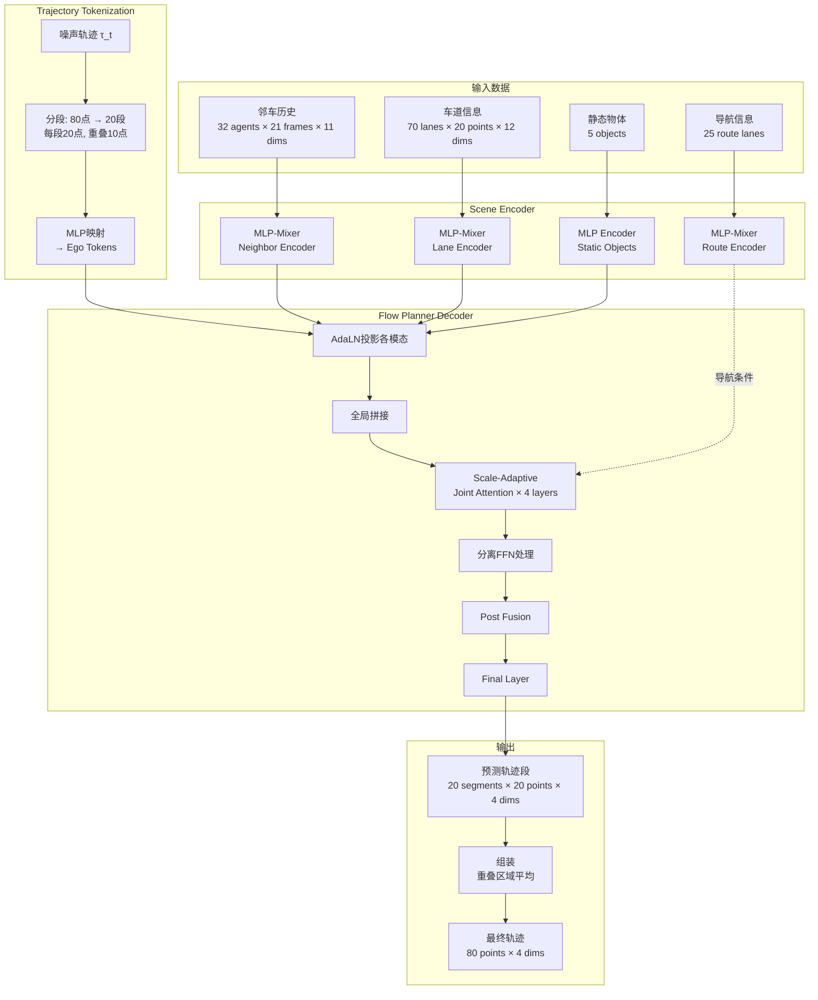
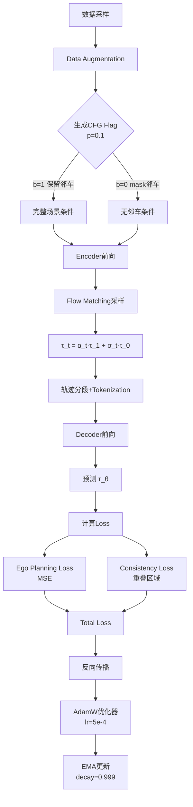
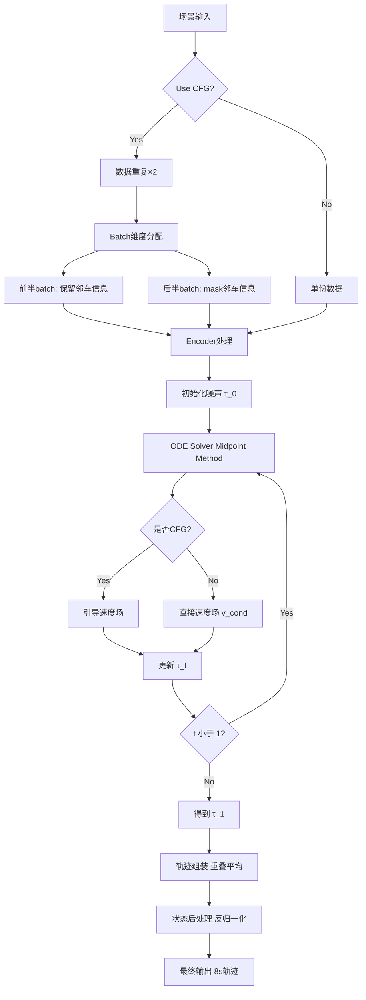

# Flow Matching-Based Autonomous Driving Planning with Advanced Interactive Behavior Modeling

- **机构**：清华大学 AIR、中科院、香港中文大学
- **代码**：https://github.com/DiffusionAD/Flow-Planner
- **论文**：https://arxiv.org/abs/2510.11083

---

## 1. 背景

自动驾驶规划的核心挑战在于建模交互式驾驶行为。现有方法存在三个主要问题：

| 问题 | 描述 |
|------|------|
| 轨迹表示粗糙 | 单token表示整条轨迹 → 过度压缩，场景融合效率低 |
| 误差累积 | 离散时间步token或自回归生成 → 误差累积严重 |
| 异构融合不足 | 静态车道、动态agent信息融合机制不够高效 |

---

## 2. 核心创新

### 2.1 细粒度轨迹分词（Fine-grained Trajectory Tokenization）

将完整轨迹 $\tau = (x_1, x_2, \dots, x_L)$ 分解为 $K$ 个重叠片段：

- 每个片段包含 $L_{seg}$ 个点，相邻片段重叠 $L_{overlap}$ 个点
- 第 $k$ 段起止时间步：
  - $l^k = (k-1)(L_{seg} - L_{overlap})$
  - $r^k = (k-1)(L_{seg} - L_{overlap}) + L_{seg}$

**默认配置**：$L_{seg}=20$，$L_{overlap}=10$，$K=20$ 个片段

**效果**：
- 保持运动学连贯性（通过重叠）
- 支持局部特征提取
- 避免自回归的误差累积

---

### 2.2 交互增强时空融合

#### 2.2.1 异构模态融合

各模态（车道、邻车、ego轨迹）先通过分离的 AdaLN 投影到统一空间，再全局拼接融合，最后通过分离的 FFN 处理：

$$
F_{global} = \text{Concat}(\text{adaLN}(F_{lane}), \text{adaLN}(F_{neighbor}), \text{adaLN}(F_{ego}))
$$

#### 2.2.2 尺度自适应自注意力（Scale-Adaptive Self-Attention）

交互强度与空间距离相关，远距离车辆/车道引入噪声。通过可学习的感受野权重动态调整注意力：

$$
F_{global} = \text{Softmax}\left(\frac{QK^T}{\sqrt{d}} - \lambda \cdot D\right)V
$$

其中：
- $D$：成对token的欧式距离矩阵
- $\lambda$：通过线性投影生成的可学习感受野标量

---

### 2.3 Flow Matching + Classifier-Free Guidance

#### 2.3.1 Flow Matching

相比扩散模型的复杂加噪/去噪过程，Flow Matching采用简单的线性插值路径：

**概率路径**：
$$
\tau_t = \alpha_t \tau_1 + \sigma_t \tau_0
$$

**训练目标**：
$$
\mathcal{L}_{flow} = \mathbb{E}_{t, \tau_0, \tau_1, b} \|\tau_\theta(\tau_t, t | (1-b) \cdot C + b \cdot \varnothing) - \tau_1\|^2
$$

其中：
- $\tau_0 \sim \mathcal{N}(0, I)$：噪声源
- $\tau_1$：目标轨迹
- $b \sim \text{Bernoulli}(p_{cfg})$：条件mask标志
- $C$：场景条件（邻车信息）

#### 2.3.2 Classifier-Free Guidance

推理时动态调整邻车交互的影响权重：

$$
\tilde{v}_t(\tau_t, t | C) = (1 - \omega) v_t(\tau_t, t) + \omega v_t(\tau_t, t | C)
$$

- $\omega > 1$：引导权重（最优值 1.80）
- 避免过度保守（无条件时）或过度激进（过度依赖条件时）

---

## 3. 模型架构

### 3.1 整体架构



### 3.2 数据流与特征图变化

#### 阶段1：Scene Encoding

| 模态 | 输入维度 | 处理 | 输出维度 |
|------|---------|------|---------|
| 邻车 | [B, 32, 21, 11] | MLP-Mixer (sequence + feature) | [B, 32, 192] |
| 车道 | [B, 70, 20, 12] | MLP-Mixer | [B, 70, 192] |
| 静态物体 | [B, 5, feature_dim] | MLP | [B, 5, 192] |
| 导航路径 | [B, 25, 20, 12] | MLP-Mixer → Mean Pooling | [B, 256] |

#### 阶段2：Ego Trajectory Tokenization

1. **噪声轨迹采样**：$\tau_t = \alpha_t \cdot \tau_1 + \sigma_t \cdot \tau_0$，Shape: [B, 1, 80, 4] (x, y, vx, vy)
2. **轨迹分段**：80 points → 20 overlapping segments，每段 $[l^k, r^k] = [(k-1) \times 10, (k-1) \times 10+20]$
3. **MLP映射**：[B, 1, 20×4=80] → MLP(80 → 256 → 256) → [B, 1, 256]
4. **拼接所有段**：Output [B, 20, 256]（20个ego tokens）

#### 阶段3：Decoder Fusion

1. **条件嵌入**：
   - Time Embedding: [B, 1, 256]
   - Route Condition: [B, 1, 256]
   - Action PE: [B, 20, 256]
   - CFG Embedding: [B, 1, 256]
   - Total Condition $y$ = time + route + action_pe + cfg，Shape: [B, 20, 256]

2. **AdaLN投影**：
   - Neighbors: [B, 32, 192] → [B, 32, 256]
   - Lanes: [B, 70, 192] → [B, 70, 256]
   - Ego: [B, 20, 256]（unchanged）

3. **全局拼接**：[B, 32+5+70+20=127, 256]

4. **Scale-Adaptive Attention (×4 layers)**：
   - Q, K, V: [B, 127, 256] → [B, num_heads=8, 127, dim_head=32]
   - 距离矩阵 $D$: [B, 127, 127]
   - 感受野权重 $\lambda$: [B, 127, 127, 8]
   - Attention: $\text{sim} = (QK^T / \sqrt{32}) - \lambda \cdot D$
   - Output: [B, 127, 256]

5. **分模态处理**：Chunk回各模态，各自通过AdaLN + FFN

6. **Post Fusion**：邻车和车道作为K,V，ego tokens作为Q，进行Cross-Attention → [B, 20, 256]

7. **Final Layer**：[B, 20, 256] → [B, 20, 80] → Reshape → [B, 20, 20, 4]

#### 阶段4：Trajectory Assembly

```
段1: points [0:20]
段2: points [10:30]
重叠区域: points [10:20]

组装策略: 线性平均
final[10:20] = (seg1[10:20] + seg2[0:10]) / 2

最终输出: Shape [B, 1, 80, 4]，表示8秒轨迹 (80 points @ 10Hz)
```

### 3.3 参数量统计

```
Encoder部分:
├─ Neighbor MLP-Mixer:  ~0.5M
├─ Lane MLP-Mixer:      ~0.5M
├─ Static MLP:          ~0.1M
├─ Route MLP-Mixer:     ~0.3M
└─ Position Embeddings: ~0.05M
Encoder Total:          ~1.45M

Decoder部分:
├─ Time Embedder:       ~0.1M
├─ Pre-projection MLP:  ~0.3M
├─ DiT Blocks (4 layers):
│  ├─ AdaLN modules:    ~0.4M
│  ├─ Joint Attention:  ~2.5M
│  ├─ FFN modules:      ~1.5M
│  └─ Total per block:  ~1.1M
│  4 blocks Total:      ~4.4M
├─ Post Fusion:         ~0.5M
├─ Final Layer:         ~0.2M
└─ Embeddings (CFG等):  ~0.1M
Decoder Total:          ~5.6M

总参数量: ~7M
```

**计算复杂度**：
- Attention: $O(n^2 \cdot d)$，其中 $n=127$ (token数), $d=256$ (hidden dim)
- 每个DiT Block: ~16M FLOPs
- 推理速度: ~12Hz (A6000 GPU)

---

## 4. 训练流程

### 4.1 训练过程



### 4.2 训练配置

| 配置项 | 值 |
|--------|-----|
| 训练集 | nuPlan 1M scenarios |
| Batch Size | 2048 (分布式8×A6000) |
| Epochs | 200+ |
| Optimizer | AdamW, lr=5e-4 |
| Scheduler | 指数衰减 |
| EMA | 0.999 decay |
| CFG Probability | 0.1 (10%样本mask邻车) |

### 4.3 一致性损失（Consistency Loss）

确保相邻轨迹段在重叠区域预测一致：

$$
\mathcal{L}_{consist} = \frac{1}{K-1} \sum_{k=1}^{K-1} \|\hat{\tau}^{k:k+1} - \hat{\tau}^{k+1:k}\|^2
$$

其中：
- $\hat{\tau}^{k:k+1}$：第k段的后10个点
- $\hat{\tau}^{k+1:k}$：第k+1段的前10个点

### 4.4 数据增强

```python
# 扰动ego初始状态 (位置、速度、航向)
perturbed_state = ego_state + random_offset
# 用5阶多项式重新插值轨迹
new_trajectory = quintic_polynomial_interpolation(perturbed_state, ego_state_at_t20)
```

---

## 5. 推理流程

### 5.1 推理过程



### 5.2 ODE求解细节

采用 Midpoint 方法（二阶精度），4步求解：

```python
# 每步时间间隔: Δt = 1/4 = 0.25
for i in range(4):
    t_current = i * 0.25
    t_mid = t_current + 0.125
    
    # 计算中点
    τ_mid = τ_t + 0.125 * v(τ_t, t_current)
    
    # 用中点速度更新
    τ_next = τ_t + 0.25 * v(τ_mid, t_mid)
    
    if use_cfg:
        v_uncond, v_cond = v.chunk(2)  # 前后半batch分离
        v = (1 - cfg_weight) * v_uncond + cfg_weight * v_cond
```

### 5.3 推理配置

| 配置项 | 值 |
|--------|-----|
| ODE求解器 | 二阶中点法 |
| 求解步数 | 4步 |
| CFG强度 $\omega$ | 1.80 |
| 推理频率 | ~12Hz (A6000 GPU) |

---

## 6. 实验结果
见论文


## 7. 与 Diffusion Planner 对比

| 维度 | Diffusion Planner | Flow Planner |
|------|-------------------|--------------|
| 生成模型 | DDPM扩散 | Flow Matching |
| 轨迹表示 | 单token整轨迹 | 20片段分词 |
| 注意力 | Vanilla Transformer | 尺度自适应 |
| 异构处理 | 统一处理 | 分离adaLN & FFN |
| CFG目标 | - | 邻居车辆掩码 |
| Val14得分 | 89.87 | 90.43 |
| interPlan | 52.90 | 61.82 (+17%) |

Flow Planner 在交互密集场景上优势显著，核心在于 CFG 机制动态增强对邻居车辆的响应

---

## 8. 代码结构

```
flow_planner/
├── model/
│   ├── flow_planner_model/
│   │   ├── flow_planner.py        # 主模型类
│   │   ├── encoder.py             # Scene Encoder
│   │   ├── decoder.py             # DiT Decoder
│   │   ├── global_attention.py    # Scale-Adaptive Attention
│   │   └── flow_utils/            # Flow matching工具
│   ├── modules/
│   │   ├── encoder_modules.py     # MLP-Mixer等
│   │   └── decoder_modules.py     # AdaLN, FFN, FinalLayer
│   └── model_utils/
│       ├── traj_tool.py           # 轨迹分段/组装
│       └── time_sampler.py        # 时间采样
├── core/
│   └── flow_matching_core.py      # 训练/推理核心逻辑
├── data/
│   ├── dataset/nuplan.py          # 数据结构
│   └── data_process/
│       └── data_processor.py      # 数据预处理
├── planner.py                     # nuPlan接口封装
└── trainer.py                     # 分布式训练脚本
```

**关键类映射**：

| 论文算法 | 代码实现 |
|---------|---------|
| FlowPlanner 整体 | `flow_planner.py::FlowPlanner` |
| Scene Encoder | `encoder.py::FlowPlannerEncoder` |
| DiT Decoder | `decoder.py::FlowPlannerDecoder` / `FlowPlannerDiT` |
| Scale-Adaptive Attention (Eq. 5) | `global_attention.py::BiasedAttention` / `JointAttention` |
| Flow Matching (Eq. 8) | `flow_matching_core.py::FlowMatchingCore.train_step()` |
| Classifier-free Guidance (Eq. 7) | `flow_planner.py::forward_inference()` |
| Trajectory Tokenization (Eq. 3) | `traj_tool.py::traj_chunking()` / `assemble_actions()` |

---

## 9. 局限与改进方向

### 9.1 局限

| 局限 | 描述 |
|------|------|
| 推理速度 | ~12Hz，工业部署需≥10Hz，需加速技术如 shortcut model |
| 隐式交互建模 | 仍依赖模仿学习，受训练数据质量限制 |
| 数据遗忘 | 无法完全覆盖长尾场景 |


