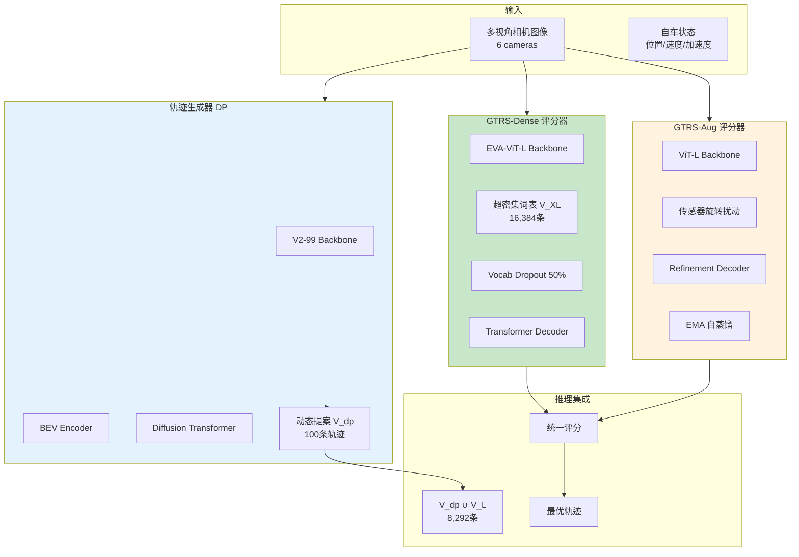
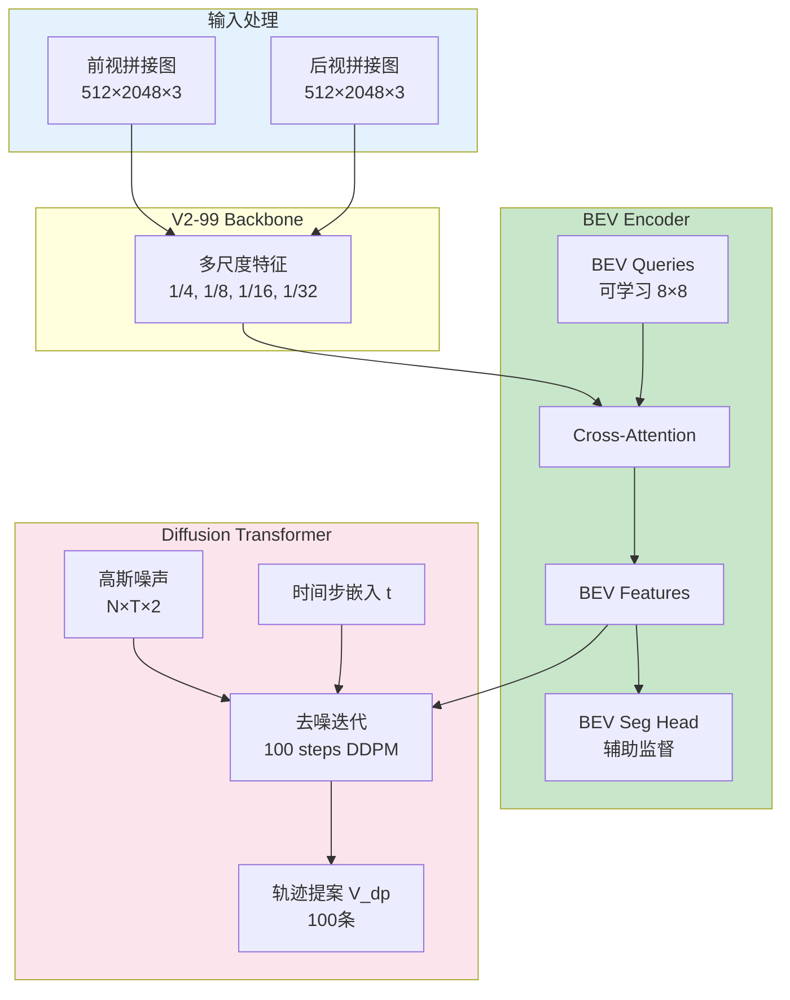
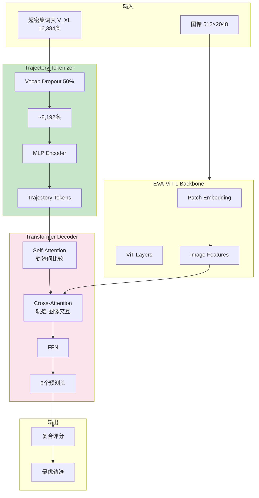
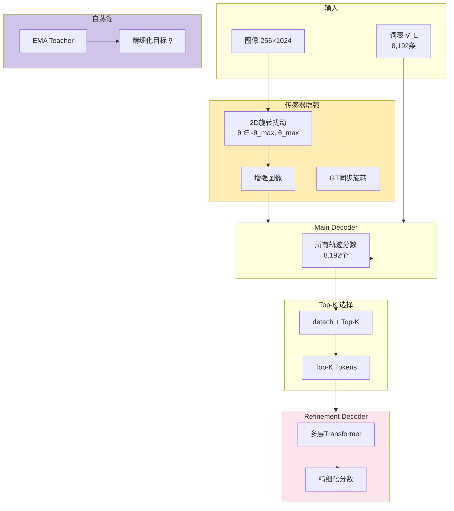
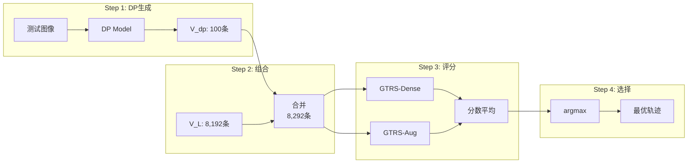

# Generalized Trajectory Scoring for End-to-end Multimodal Planning

- **代码**：https://github.com/NVlabs/GTRS
- **论文**：https://arxiv.org/abs/2506.06664

## 概述

GTRS（Generalized Trajectory Scoring）：NVIDIA提出的端到端多模态轨迹规划框架，Navsim v2 Challenge冠军方案。
核心思路：结合粗粒度候选轨迹与细粒度动态生成轨迹，训练通用轨迹评分器，实现跨分布泛化。

**核心公式**：
$$\tau^* = \arg\max_{\tau \in \mathcal{V}} f_\theta(\tau | \mathbf{I})$$

---

## 一、整体框架

### 1.1 三大组件



### 1.2 关键符号

| 符号 | 维度 | 含义 |
|------|------|------|
| $\mathcal{V}_{dp}$ | $100 \times T \times 2$ | DP生成的动态轨迹 |
| $\mathcal{V}_{XL}$ | $16384 \times T \times 2$ | 超密集静态词表 |
| $\mathcal{V}_L$ | $8192 \times T \times 2$ | 标准静态词表 |
| $\mathbf{F}_{bev}$ | $H_b \times W_b \times C$ | BEV特征 |
| $\mathbf{s}$ | $N$ | 轨迹分数 |

---

## 二、DP 轨迹生成器

### 2.1 架构



### 2.2 一阶微分归一化

将绝对坐标转换为相邻点位移：

$$\Delta p_i = p_i - p_{i-1}$$

**归一化**：
$$x_{diff}^{norm} = \frac{(x_t - x_{t-1}) - \mu_x}{\sigma_x}$$

统计量：$\mu_x = 2.95$，$\sigma_x = 4.53$（x方向），$\mu_y = 0.061$，$\sigma_y = 5.01$（y方向）

**航向角编码**：使用 $\sin(\theta)$、$\cos(\theta)$ 避免周期性不连续

**逆变换**：
$$p_i = p_0 + \sum_{j=1}^{i} (\Delta p_j^{norm} \cdot \sigma + \mu)$$

### 2.3 DDPM 配置

| 参数 | 值 |
|------|-----|
| 去噪步数 | 100 |
| $\beta$ 调度 | squaredcos_cap_v2 |
| $\beta$ 范围 | 0.0001 → 0.02 |
| 预测类型 | $\epsilon$ (噪声预测) |

**训练损失**：
$$\mathcal{L}_{DP} = \mathbb{E}_{t,\tau_0,\epsilon}[\|\epsilon - \epsilon_\theta(\tau_t, t, \mathbf{F}_{bev})\|^2] + \lambda_{bev}\mathcal{L}_{bev}$$

### 2.4 特征图变化

| 阶段 | 尺度 |
|------|------|
| 输入图像 | 512×2048×3 |
| Backbone输出 | 逐层降采样 1/4~1/32 |
| BEV Features | H_bev×W_bev×C (通常200×200或128×128) |
| 噪声轨迹 | 100×8×4 |
| 输出轨迹 | 100×8×3 |

---

## 三、GTRS-Dense 评分器

### 3.1 架构



### 3.2 Vocabulary Dropout

| 阶段 | 词表大小 | Dropout | 说明 |
|------|---------|---------|------|
| 训练 | V_XL (16,384) | 50% | 随机保留8,192条 |
| 推理 | V_L (8,192) + V_dp (100) | 无 | 合并8,292条 |

**作用**：
1. 数量对齐：训练~8,192 ≈ 推理8,292
2. 分布偏移：每batch看到不同子集，学习泛化表示
3. 正则化：防止记忆特定轨迹ID

### 3.3 复合评分函数

$$\text{score} = 0.03 \cdot \log(\text{softmax}(\text{imi})) + 0.1 \cdot \log(\sigma(\text{TLC})) + 0.1 \cdot \log(\sigma(\text{NC})) + 0.9 \cdot \log(\sigma(\text{DAC})) + 0.2 \cdot \log(\sigma(\text{DDC})) + 6.0 \cdot \log(7\sigma(\text{TTC}) + 7\sigma(\text{EP}) + 3\sigma(\text{LK}))$$

**8个指标**：
1. **imi** - 模仿学习（与GT相似度）
2. **NOC** - 无碰撞
3. **DAC** - 可行驶区域合规
4. **TTC** - 碰撞时间边界
5. **EP** - 自车进度
6. **DDC** - 行驶方向合规
7. **LK** - 车道保持
8. **TLC** - 交通灯合规

### 3.4 训练损失

**IMI损失**（软目标）：
$$\mathcal{L}_{imi} = \text{CE}(\text{pred}, \text{softmax}(-\|vocab - gt\_traj\|^2 / \sigma))$$

**PDM损失**（硬目标）：
$$\mathcal{L}_{pdm} = \sum_m \alpha_m \cdot \text{BCE}(s^m, \hat{y}^m)$$

---

## 四、GTRS-Aug 评分器

### 4.1 架构特点



### 4.2 传感器扰动

旋转变换：
$$\begin{bmatrix} x' \\ y' \end{bmatrix} = \begin{bmatrix} \cos\theta & -\sin\theta \\ \sin\theta & \cos\theta \end{bmatrix} \begin{bmatrix} x \\ y \end{bmatrix}$$

图像和GT轨迹必须同步旋转，保持标签一致性。

### 4.3 自蒸馏机制

**EMA Teacher更新**：
$$\theta_{teacher}^{(t+1)} = \alpha \cdot \theta_{teacher}^{(t)} + (1-\alpha) \cdot \theta_{student}^{(t)}$$

$\alpha \approx 0.999$

**精细化目标**：
$$\tilde{y}_i^m = \hat{y}_i^m + \text{clip}(s_{i,teacher}^m - \hat{y}_i^m, -\delta_m, \delta_m)$$

- $\hat{y}$：GT分数
- $s_{teacher}$：Teacher预测
- $\delta_m$：裁剪范围（防止偏离GT过远）

**作用**：Teacher提供连续软标签，平滑GT噪声，clip限制修正幅度。

### 4.4 多阶段Refinement

```
8,192条 → Coarse Decoder → Top-512
          ↓
512条 → Refinement Stage 1 → Top-128
          ↓
128条 → Refinement Stage 2 → Best 1
```

**Offset Refinement模式**：
$$s_{l+1}^m = s_l^m + \text{offset}_l$$

逐层递进精细化。

### 4.5 训练 vs 推理

| 阶段 | 传感器扰动 | Main Decoder | Refinement | 自蒸馏 |
|------|----------|--------------|------------|--------|
| 训练 | ✓ | ✓ | ✓ | ✓ |
| 推理 | ✗ | ✓ | ✗ | ✗ |

Refinement仅训练时使用，推理时只用Main Decoder，不增加开销。

---

## 五、训练流程

### 5.1 三阶段独立训练

| 阶段 | 模型 | Epochs | 词表 |
|------|------|--------|------|
| 1 | DP Generator | 50 | - |
| 2 | GTRS-Dense | 20 | V_XL + Dropout |
| 3 | GTRS-Aug | 20 | V_L |

### 5.2 超参数

| 参数 | DP | Dense | Aug |
|------|-----|-------|-----|
| Backbone | V2-99 | EVA-ViT-L | ViT-L |
| 图像尺寸 | 512×2048 | 512×2048 | 256×1024 |
| Batch Size | 528 | 528 | 528 |
| Learning Rate | 2e-4 | 2e-4 | 2e-4 |
| 参数量 | ~65M | ~325M | ~330M |

---

## 六、推理流程

### 6.1 统一评分策略



### 6.2 集成策略

**分数融合**：
$$\mathbf{s}_{ensemble} = \frac{1}{M}\sum_{m=1}^{M} \mathbf{s}^{(m)}$$

**轨迹选择**：
$$\tau^* = \mathcal{V}[\arg\max_i s_{ensemble,i}]$$

---

## 七、性能结果

### 7.1 消融实验

| 配置 | 训练词表 | 推理词表 | EPDMS |
|------|---------|---------|-------|
| DP随机选择 | - | V_dp | 25.6 |
| Dense (无Dropout) | V_XL | V_dp ∪ V_L | 42.0 |
| Dense (有Dropout) | V_XL | V_dp ∪ V_L | **43.4** |
| Aug | V_L | V_dp ∪ V_L | **43.4** |

**Zero-shot泛化**：仅在V_XL训练 → V_dp测试：36.7 (vs 随机25.6)

### 7.2 最终性能 (Navhard)

| 方法 | EPDMS |
|------|-------|
| DP (随机选择) | 25.6 |
| GTRS-Dense (单模型) | 45.3 |
| GTRS-Aug (单模型) | 44.7 |
| GTRS-E-Lite (2模型) | 46.6 |
| GTRS-E (6模型) | **49.4** |
| PDM-Closed (GT感知) | 51.3 |

GTRS-E达到GT感知方法的96.3%性能。

---

## 八、核心创新总结

### 8.1 技术创新

1. **超密集词表训练**：训练16,384条，推理8,192条，强制学习泛化表示
2. **Vocabulary Dropout**：50%随机丢弃，对齐训练推理分布，正则化
3. **一阶微分归一化**：预测位移而非绝对坐标，数值稳定，平移不变
4. **训练-推理分离组合**：训练时仅用静态词表，推理时组合动态+静态
5. **EMA自蒸馏**：Teacher提供软监督，平滑GT噪声
6. **多阶段渐进细化**：512→128→1，精细区分相似轨迹


---

## 九、代码要点

### 9.1 关键代码位置

| 功能 | 文件 | 说明 |
|------|------|------|
| DP模型 | `dp/dp_model.py` | Diffusion Transformer |
| 差分归一化 | `dp/dp_model.py:160-176` | diff_traj / cumsum_traj |
| 词表Dropout | `gtrs_dense/hydra_model.py:232-240` | 训练时随机采样 |
| 统一评分 | `gtrs_dense/hydra_model.py:281-356` | eval_dp_proposals() |
| 多阶段细化 | `gtrs_aug/hydra_model.py:528-622` | Refinement Decoder |
| EMA更新 | `agent_lightning_module_aug.py:121-147` | optimizer_step后更新 |

### 9.2 项目结构

```
GTRS/
├── navsim/
│   ├── agents/
│   │   ├── dp/              # DP生成器
│   │   ├── gtrs_dense/      # Dense评分器
│   │   └── gtrs_aug/        # Aug评分器
│   └── planning/
│       └── training/        # 训练逻辑
└── traj_final/              # 轨迹词表
```
