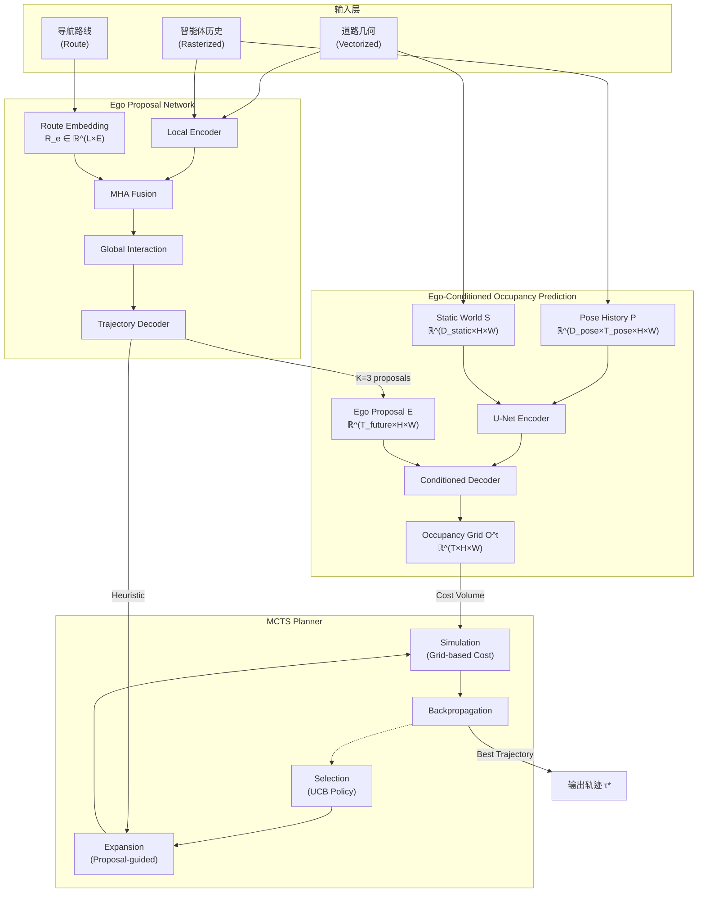
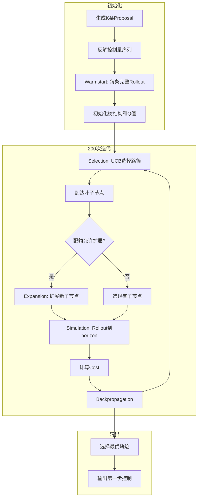

# HYPE: Hybrid Planning with Ego Proposal-Conditioned Predictions

- **论文**：https://arxiv.org/abs/2510.12733

## 一、概览

1. **学习的多模态 Ego 提案**：替代传统车道中心线采样
2. **Ego 条件的占用预测**：建模自车与他车的双向交互
3. **MCTS 精炼搜索**：以模型轨迹为先验进行局部优化

## 二、整体架构



---

## 三、数据流与维度

### 输入数据

| 组件 | 维度 | 说明 |
|------|------|------|
| 历史姿态 P | $(2 \times 10 \times 400 \times 400)$ | Ego + 其他车辆历史二值栅格 |
| 静态地图 S | $(3 \times 400 \times 400)$ | 车道方向/可行驶区域/车道线 |
| 路线 R | $(L \times 3)$ | 导航路点 $(x, y, \theta)$ |

### 栅格配置

- 分辨率：0.25 m/pixel
- 尺寸：$400 \times 400$（覆盖 100m × 100m）
- 历史帧数：$T_{pose} = 10$（1秒 @ 10Hz）
- 预测帧数：$T_{future} = 30$（3秒 @ 10Hz）

---

## 四、Ego Proposal Network

### 基础架构

基于 HiVT (Hierarchical Vector Transformer) 多模态预测框架，增加显式路线嵌入引导。

### 特征融合公式

$$F'_{ego} = \text{MLP}_f\left(\left[ F_{ego}, \text{MHA}(F_{ego}, R_e, R_e) \right]\right) \in \mathbb{R}^{E}$$

- $R_e \in \mathbb{R}^{L \times E}$：路线嵌入，$L$ 为路点数，$E=128$ 为嵌入维度
- $F_{ego} \in \mathbb{R}^{E}$：原始 Ego 特征
- MHA 让 Ego 特征"关注"路线信息，生成与导航目标一致的提案

### 维度变化

```
Route waypoints: (L, 3) → MLP → R_e: (L, 128)
Ego feature: (128,) + MHA output: (128,) → Concat → (256,) → MLP → F'_ego: (128,)
Output: K=3 trajectories, each (30, 3) = 30个时间步 × (x, y, θ)
```

### 三个Proposal的含义

每个Proposal代表一种驾驶策略（如激进通过、保守跟车、变道绕行），网络同时输出每个提案的置信度。

---

## 五、Ego-Conditioned Occupancy Prediction

### 网络架构

U-Net 变体，在解码器每个上采样阶段注入 Ego 提案信息：

$$\text{Decoder}^{(i)} = \text{UpConv}(\text{Feature}^{(i)}) + \text{Conv}(\mathbf{E})$$

### 输入组成

| 组件 | 符号 | 维度 | 说明 |
|------|------|------|------|
| 历史姿态 | $\mathbf{P}$ | $\mathbb{R}^{D_{pose} \times T_{pose} \times H \times W}$ | 历史占用栅格 |
| 静态地图 | $\mathbf{S}$ | $\mathbb{R}^{D_{static} \times H \times W}$ | 静态地图 |
| Ego 提案 | $\mathbf{E}$ | $\mathbb{R}^{T_{future} \times H \times W}$ | Ego 未来轨迹栅格 |

### 条件机制的作用

不同的 Ego 提案会导致不同的他车反应预测：
- Ego 要插队 → 前车可能减速让行
- Ego 要直行 → 侧方车辆可能加速超车

---

## 六、MCTS 规划模块

### 四步迭代流程



### Selection: UCB 策略

$$\underset{n_{i} \in \text{children}(n_{t})}{\arg \max} \left[\frac{Q(n_i)}{V(n_i)} + c \sqrt{\frac{\ln V(n_t)}{V(n_i)}}\right]$$

- $Q(n_i)$：子节点累积奖励
- $V(n_i), V(n_t)$：子节点/父节点访问次数
- $c = \sqrt{2}$：探索常数

### Expansion: 渐进扩宽

$$N_{expand} = \lfloor k \cdot v_n^{\gamma} \rfloor$$

- $k=2.0$，$\gamma=0.5$
- 扰动范围：加速度 $\pm 0.5$ m/s²，转向 $\pm 0.1$ rad

| 访问次数 $v_n$ | 允许子节点数 |
|---|---|
| 1 | 2 |
| 4 | 4 |
| 9 | 6 |
| 16 | 8 |

### Simulation: 代价函数

$$C(\tau) = \max_{t=1}^{T} \sum_{x,y} W_{ego}(x,y) * \left(\alpha O^t(x,y) + \beta D^t(x,y)\right)$$

| 符号 | 含义 |
|---|---|
| $W_{ego}$ | 固定 Ego 形状卷积核 |
| $O^t$ | 预测占用栅格（碰撞风险） |
| $D^t$ | 到提案轨迹的距离场（偏离惩罚） |
| $\alpha, \beta$ | 权重系数（$\alpha \gg \beta$） |

**取时间维度最大值**而非累加：关注最危险时刻，实现一票否决制。

### Rollout 策略

使用自行车模型传播状态，添加高斯噪声：
- 加速度噪声：$\sigma_a = 0.2$ m/s²
- 转向噪声：$\sigma_{\delta} = 0.03$ rad

---

## 七、代价计算详解

### 卷积核 $W_{ego}$

车辆尺寸约 4.5m × 2m，栅格分辨率 0.25m/pixel，核尺寸约 18×8 pixels。

**局限性**：固定核无法精确处理转弯时的航向角变化，可能采用保守近似（外接圆/正方形）。

### 偏离图 $D^t$

对每个时刻 $t$，计算栅格中各点到提案轨迹的距离。提案轨迹中心线距离为 0，越远距离越大。

### 代价计算流程

```python
def compute_trajectory_cost(trajectory, O, D, W_ego, alpha, beta):
    """
    trajectory: MCTS rollout轨迹 [(x_1,y_1,θ_1), ..., (x_T,y_T,θ_T)]
    O: 占用预测 (T, H, W)
    D: 偏离图 (T, H, W)
    """
    costs = []
    for t in range(T):
        # 组合代价图
        cost_map = alpha * O[t] + beta * D[t]
        # 卷积得到空间代价
        spatial_cost = convolve2d(cost_map, W_ego_rotated)
        # 取当前步最大值
        costs.append(spatial_cost.max())
    
    return max(costs)  # 取时间最大值
```

---

## 八、Warmstart 策略 ？


## 九、Learned Proposal 的控制量反解？

Proposal Network 输出的是轨迹点序列 $(x_t, y_t, \theta_t)$，MCTS 使用前需要反解控制量：

$$a_t = \frac{v_{t+1} - v_t}{\Delta t}$$

$$\delta = \arctan\left(\frac{L \cdot \dot{\theta}}{v}\right)$$

其中 $L$ 为轴距，$v$ 为速度。

## 十、训练过程

采用分阶段训练，非端到端：

### 阶段一：Ego Proposal Network

- 数据：1秒历史 + 静态地图 + 路线路点
- 标签：3秒未来真实轨迹

$$\mathcal{L}_{proposal} = \min_{k} \left[\text{ADE}_k + \text{FDE}_k\right] + \text{NLL}(\pi)$$

- ADE：平均位移误差
- FDE：终点位移误差
- NLL：负对数似然（多模态概率 $\pi$）

### 阶段二：Occupancy Prediction

- 数据：历史姿态 P + 静态地图 S + Ego 提案栅格 E
- 标签：未来 30 步的真实占用网格

$$\mathcal{L}_{occ} = -\frac{1}{T \cdot H \cdot W} \sum_{t,x,y} \left[y^t_{xy} \log(\hat{y}^t_{xy}) + (1-y^t_{xy}) \log(1-\hat{y}^t_{xy})\right]$$

### 阶段三：MCTS

无需训练，是推理时优化模块。

---

## 十一、推理时间

| 模块 | 三模态耗时 |
|---|---|
| Ego Proposal | 0.079s |
| Rasterization | 0.136s |
| Occupancy Pred | 0.050s |
| MCTS Planning | 0.396s |
| **总计** | **0.661s** |

**优化方向**：GPU 加速栅格化（可降至 5ms）、并行化 MCTS。

---

## 十二、实验结果


## 十三、创新点对比

| 对比维度 | 传统方法 (DTPP等) | HYPE          |
| ---- | ------------ | ------------- |
| 提案来源 | 车道中心线 + 固定速度 | 学习的多模态网络      |
| 预测方式 | 目标级独立预测      | 占用栅格 + Ego 条件 |
| 场景感知 | 仅依赖几何约束      | 隐式编码长期交互      |
| 代价函数 | 需要数十个手动调参项   | 仅碰撞 + 偏离两项    |

**代价函数简化原因**：提案网络已隐式学习车道遵循、舒适驾驶、速度合理性，MCTS 只需微调和安全保障。

---

## 十四、关键超参数

```yaml
# 时序配置
history_length: 1s @ 10Hz (10 frames)
planning_horizon: 3s @ 10Hz (30 frames)

# 空间配置
raster_size: [400, 400]
resolution: 0.25 m/pixel
local_radius: 50m

# 网络配置
embedding_dim: 128
num_proposals: K=3

# MCTS配置
iterations: 200 per proposal
progressive_widening: k=2.0, γ=0.5
perturbation_acc: ±0.5 m/s²
perturbation_steer: ±0.1 rad
ucb_constant: c=√2
```

---

## 十五、实现细节与设计选择

### 已明确的设计

| 模块 | 设计选择 | 原因 |
|---|---|---|
| Proposal | Learned 多模态轨迹 | 捕获长期交互，提供强先验 |
| Occupancy | Ego-conditioned | 场景一致性，交互感知 |
| Cost 函数 | Grid 卷积 + Max 时间聚合 | 简化设计，关注最危险时刻 |
| 搜索 | Proposal-guided MCTS | 平衡探索与利用 |
| 扩展控制 | Progressive Widening | 避免指数爆炸 |

### 论文未明确的细节

| 问题             | 可能的处理               |
| -------------- | ------------------- |
| 航向角与固定 kernel  | 保守近似或多角度预计算         |
| 累积误差           | 每步重新计算跟踪控制量         |
| Warmstart 具体实现 | 论文："per proposal"迭代 |


---


