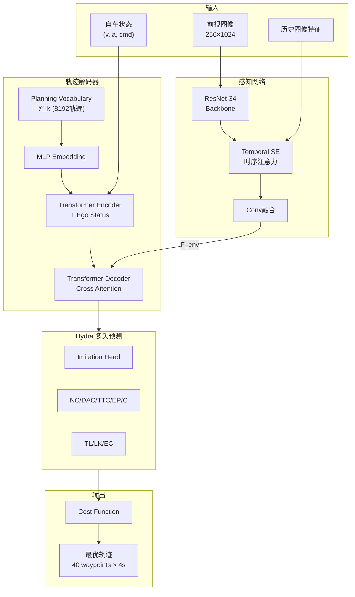
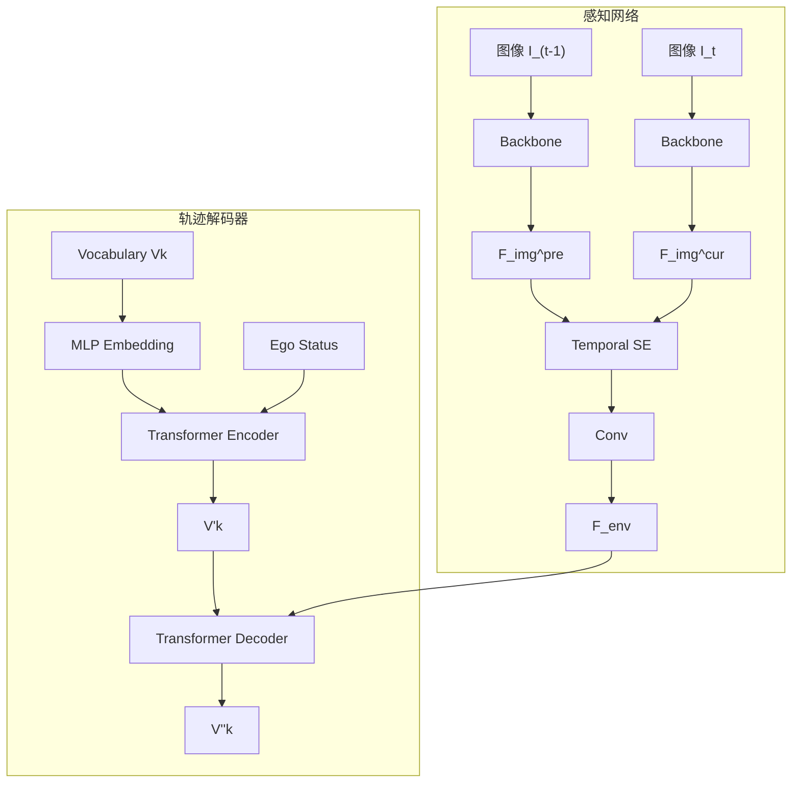
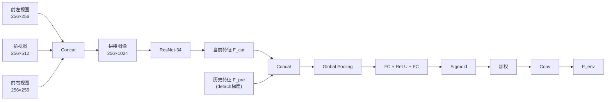
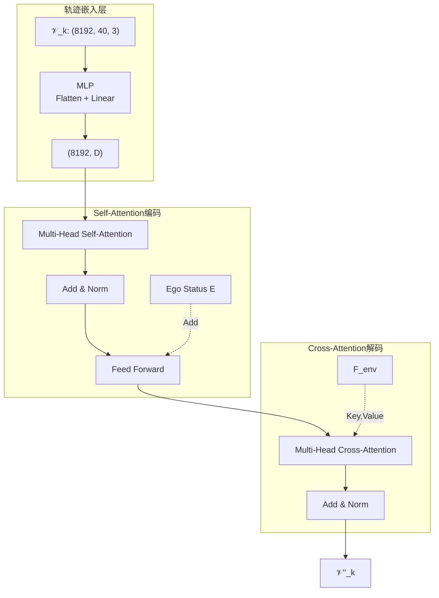
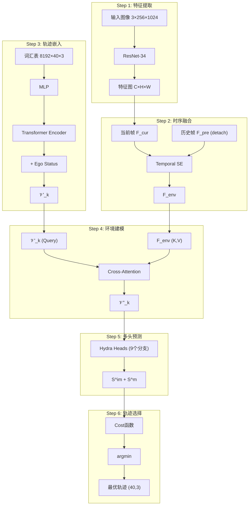
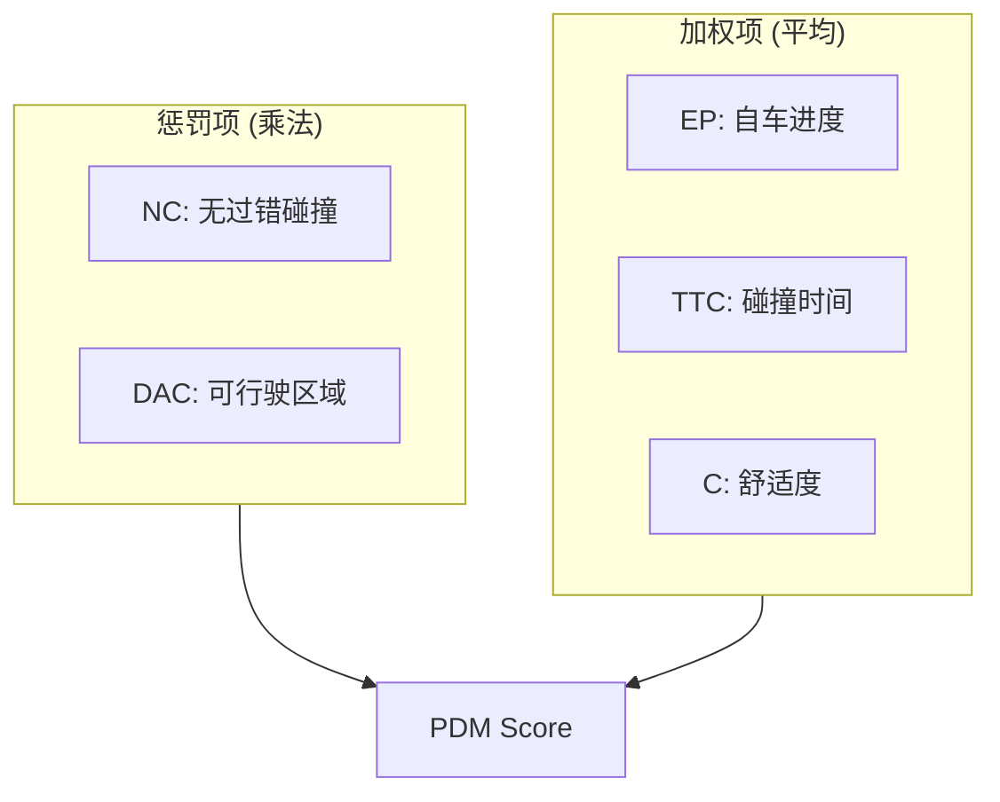
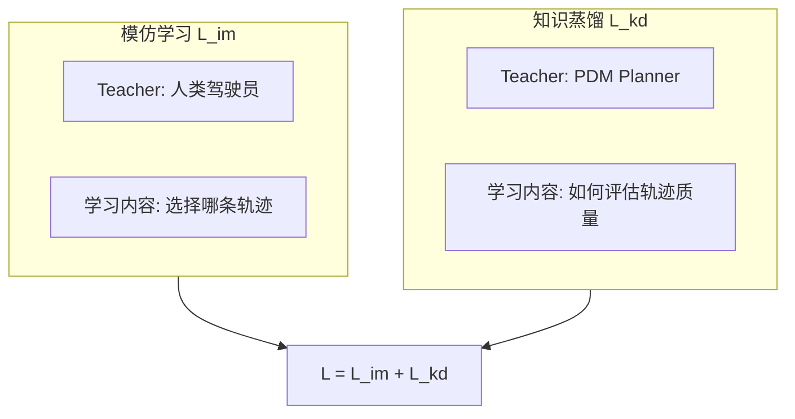

# Hydra-MDP++: Advancing End-to-End Driving via Expert-Guided Hydra-Distillation
- **代码**：https://github.com/NVlabs/Hydra-MDP
- **论文**：https://arxiv.org/abs/2503.12820

## 概览

**核心思想**: 端到端自动驾驶框架，通过多头解码器的Hydra蒸馏机制，同时学习人类驾驶演示和Rule-based专家知识，在NAVSIM基准达到91.0% PDM Score。

**主要创新**:
1. **Hydra蒸馏架构**: 多头网络分别学习模仿学习和多个规则专家
2. **扩展教师网络**: 新增交通灯遵守(TL)、车道保持(LK)、扩展舒适度(EC)三个专家
3. **轻量级设计**: 仅用ResNet-34达到SOTA，无需LiDAR或复杂模块
4. **离散动作空间**: 采用K-means聚类的轨迹词汇表，支持离线专家评分

---

## 整体框架



**参数量**:
- ResNet-34: ~21.8M
- V2-99: ~99M
- 推理延迟: ResNet-34版本 206.2ms，V2-99版本 271.0ms (V100 GPU)

---

## 训练流程

### 离线准备阶段


每条轨迹包含40个时间戳的 $(x, y, \theta)$ 坐标，对应10Hz频率和4秒未来时域。

对于训练集每个场景，运行PDM-style仿真获得各metric的ground truth scores：
- $\hat{S}^{NC}$: 无过错碰撞分数 (0或1)
- $\hat{S}^{DAC}$: 可行驶区域合规分数 (0或1)
- $\hat{S}^{EP}$: 自车进度分数 (0~1)
- $\hat{S}^{TTC}$: 碰撞时间分数 (0~1)
- $\hat{S}^{C}$: 舒适度分数 (0~1)

### 在线训练阶段



环境tokens计算：
$$F_{env} = \text{Conv}(\text{TemporalSE}(\text{Concat}(F_{img}^{pre}, F_{img}^{cur})))$$

轨迹嵌入编码：
$$\mathcal{V}'_k = \text{Transformer}(Q, K, V = \text{MLP}(\mathcal{V}_k)) + E$$

环境交叉注意力：
$$\mathcal{V}''_k = \text{Transformer}(Q = \mathcal{V}'_k, K, V = F_{env})$$

### 损失函数

**模仿学习损失** (交叉熵):
$$\mathcal{L}_{im} = -\sum_{i=1}^{k} y_i \log(S_i^{im})$$

其中软标签：
$$y_i = \frac{e^{-\|\hat{T} - T_i\|^2}}{\sum_{j=1}^{k} e^{-\|\hat{T} - T_j\|^2}}$$

$\hat{T}$ 是人类log-replay轨迹，$T_i$ 是vocabulary中第 $i$ 条轨迹。

**知识蒸馏损失** (二元交叉熵):
$$\mathcal{L}_{kd} = -\sum_{m,i} \left[ \hat{S}_i^m \log S_i^m + (1 - \hat{S}_i^m) \log(1 - S_i^m) \right]$$

**总损失**:
$$\mathcal{L} = \mathcal{L}_{im} + \mathcal{L}_{kd}$$

**训练配置**:
```python
batch_size = 256  # 8×V100 GPUs
epochs = 20
learning_rate = 1e-4
optimizer = "AdamW"
input_resolution = (256, 1024)
temporal_frames = 2
output_horizon = 4.0  # 秒
waypoints = 40
```

---

## 模块详解

### 感知网络

**核心组件**:
- Image Backbone: ResNet-34 或 VoVNet-99
- Temporal SE Module: 时序Squeeze-and-Excitation注意力



**特殊设计**:
- Temporal SE在时间维度做注意力，而非传统SE的通道维度
- 历史帧梯度detach，不参与反向传播，减少计算和内存

### 轨迹解码器

**离散动作空间配置**:
- 词汇表大小: k = 8192
- 轨迹格式: 40 waypoint × $(x, y, \theta)$
- 生成方式: 从nuPlan 700K轨迹中K-means聚类



**离散化优势**:
1. 可离线预计算专家分数，避免在线仿真
2. 8192个轨迹覆盖多样驾驶行为
3. 分类选择比连续回归更稳定

### Hydra多头蒸馏

每个预测头专注一个专家指标：

| 头部 | 符号 | 专家类型 | 评估内容 | 约束类型 |
|-----|-----|---------|---------|---------|
| Imitation | $S^{im}$ | 人类演示 | 与人类轨迹相似度 | 加权 |
| No Collision | $S^{NC}$ | 规则专家 | 无过错碰撞 | 惩罚 |
| Drivable Area | $S^{DAC}$ | 规则专家 | 可行驶区域 | 惩罚 |
| Time-to-Collision | $S^{TTC}$ | 规则专家 | 碰撞时间安全性 | 加权 |
| Ego Progress | $S^{EP}$ | 规则专家 | 导航进度 | 加权 |
| Comfort | $S^{C}$ | 规则专家 | 加速度/抖动 | 加权 |
| Traffic Light | $S^{TL}$ | 扩展专家 | 交通灯遵守 | 惩罚 |
| Lane Keeping | $S^{LK}$ | 扩展专家 | 车道保持 | 加权 |
| Extended Comfort | $S^{EC}$ | 扩展专家 | 帧间一致性 | 加权 |

---

## 推理流程



**推理时Cost函数**:
$$\tilde{f}(T_i, O) = -\left( k_{im} \log S_i^{im} + \sum_{m \in \mathcal{M}_{penalties}} k_m \log S_i^m + k_w \log \sum_{w \in \mathcal{M}_{weighted}} \text{weight}_w S_i^w \right)$$

其中:
- $\mathcal{M}_{penalties} = \{NC, DAC, TL\}$ — 任一为0则总分为0（硬约束）
- $\mathcal{M}_{weighted} = \{TTC, C, EP, LK, EC\}$ — 加权平均（软约束）
- $\{k_{im}, k_m, k_w\}$ 通过网格搜索优化

**维度变化**:

| 阶段 | 输入维度 | 输出维度 |
|-----|---------|---------|
| 图像编码 | (B, 3, 256, 1024) | (B, 512, 8, 32) |
| 时序融合 | (B, C, H, W) × 2帧 | (B, C, H, W) |
| 轨迹嵌入 | (8192, 40, 3) | (8192, D) |
| 交叉注意力 | Q:(8192,D), KV:(HW,C) | (8192, D) |
| Hydra预测 | (8192, D) | (8192, 9) |
| 轨迹选择 | (8192, 9) | (40, 3) |

---

## PDM Planner

### 评分系统

PDM-Planner是nuPlan数据集上的SOTA规则规划器，整合了IDM和多种超参数。



**PDM Score计算**:
$$\text{PDMS} = (NC \times DAC) \times \frac{5 \times TTC + 2 \times C + 5 \times EP}{12}$$

### 扩展指标 (Hydra-MDP++新增)

| 指标 | 计算方式 | 阈值 |
|-----|---------|-----|
| Traffic Light (TL) | 红灯时越过人行道则为0 | - |
| Driving Direction (DDC) | 车辆位置投影到车道方向的距离 | $\tau_D = 0.5m$ |
| Lane Keeping (LK) | 与车道线最小距离 | $\tau_D = 0.5m$ |
| Extended Comfort (EC) | 当前帧与前帧预测轨迹的差异 | 加速度0.7 m/s²，抖动0.5 m/s³ |

**扩展舒适度计算**:
$$d_A = \sqrt{\frac{1}{T}\sum_{t=1}^{T}(y_{current,t}^A - y_{preceding,t}^A)^2}$$

若 $d_A \leq \tau_A$ 且其他指标满足，则 $S^{EC} = 1$。

**Extended PDM Score**:
$$\text{EPDMS} = \prod_{m \in \{NC,DAC,DDC,TL\}} S^m \times \frac{\sum_{w \in \{EP,TTC,C,LK,EC\}} \text{weight}_w \cdot S^w}{\sum \text{weight}_w}$$

---

## 两种学习目标



| 对比项 | 模仿学习 $\mathcal{L}_{im}$ | 知识蒸馏 $\mathcal{L}_{kd}$ |
|-------|---------------------------|---------------------------|
| Teacher | 人类驾驶员 | PDM Planner |
| 学习目标 | 学"选哪条轨迹" | 学"如何评价轨迹" |
| 监督形式 | 轨迹相似度软标签 | 各metric分数 |
| 本质 | 模仿行为 | 模仿评判标准 |

**为何结合两者**:
- 只用模仿学习：可能学到不安全行为，人类也会犯错
- 只用PDM蒸馏：缺乏人类驾驶的细腻感，规则无法覆盖所有情况
- 结合使用：学习人类驾驶习惯的同时遵守安全规则

---

## Classification-based vs Regression-based

Hydra-MDP++采用分类式轨迹解码，输出只能是词汇表中的一条轨迹：

| 特性 | Classification-based (本文) | Regression-based |
|-----|---------------------------|------------------|
| 输出空间 | 离散，k条候选 | 连续，任意轨迹 |
| 输出形式 | 从vocabulary选择 | 直接回归坐标 |
| 代表方法 | Hydra-MDP++, CoverNet, VADv2 | UniAD, VAD, Transfuser |

**选择离散空间的原因**:
1. 支持离线仿真蒸馏——vocabulary固定，可预先计算GT scores
2. 更好处理多模态性——同时评估多种可能决策
3. 避免模式平均问题——回归方法在多模态时易产生"平均"轨迹

**潜在局限**:
- 精度受限于vocabulary覆盖度
- vocabulary大小需权衡：太小覆盖不够，太大计算开销增加

k=8192条轨迹从700K真实轨迹聚类得到，可较好覆盖常见驾驶场景。

---

## 工程技巧

### 梯度Detach策略
```python
F_img_pre = F_img_pre.detach()  # 历史帧不回传梯度
```
减少反向传播路径，内存占用减少~30%，训练加速。

### 离线专家评分
传统方法在线运行PDM-Planner评估每条轨迹，训练慢。Hydra-MDP++离线预计算8192轨迹的专家分数，训练时直接加载。

### 网格搜索权重
```python
k_im = 1.0    # 模仿权重
k_m = 10.0    # 惩罚项权重
k_w = 5.0     # 加权项权重
```
在验证集上搜索最优组合。

### K-means聚类细节
- 采样源: nuPlan 700K真实轨迹
- 聚类特征: 40 waypoint × 3维 = 120维
- 聚类数: k=8192
- 距离度量: L2距离

---

## 公式速查

| 公式名称 | 表达式 |
|---------|--------|
| 环境特征融合 | $F_{env} = \text{Conv}(\text{TemporalSE}(\text{Concat}(F_{img}^{pre}, F_{img}^{cur})))$ |
| 轨迹嵌入编码 | $\mathcal{V}_k' = \text{Transformer}(Q,K,V=\text{MLP}(\mathcal{V}_k)) + E$ |
| 环境交叉注意力 | $\mathcal{V}_k'' = \text{Transformer}(Q=\mathcal{V}_k', K,V=F_{env})$ |
| 模仿学习损失 | $\mathcal{L}_{im} = -\sum_i y_i \log(S_i^{im})$ |
| 模仿软标签 | $y_i = \frac{e^{-\|\hat{T}-T_i\|^2}}{\sum_j e^{-\|\hat{T}-T_j\|^2}}$ |
| 知识蒸馏损失 | $\mathcal{L}_{kd} = -\sum_{m,i}[\hat{S}_i^m \log S_i^m + (1-\hat{S}_i^m)\log(1-S_i^m)]$ |
| 推理Cost函数 | $\tilde{f}(T_i) = -(k_{im}\log S_i^{im} + \sum_m k_m \log S_i^m + k_w \log\sum_w \text{weight}_w S_i^w)$ |
| PDM Score | $\text{PDMS} = NC \times DAC \times \frac{5 \cdot TTC + 2 \cdot C + 5 \cdot EP}{12}$ |
| Extended PDM | $\text{EPDMS} = NC \cdot DAC \cdot DDC \cdot TL \times \frac{5 \cdot TTC+2 \cdot C+5 \cdot EP+5 \cdot LK+5 \cdot EC}{22}$ |
