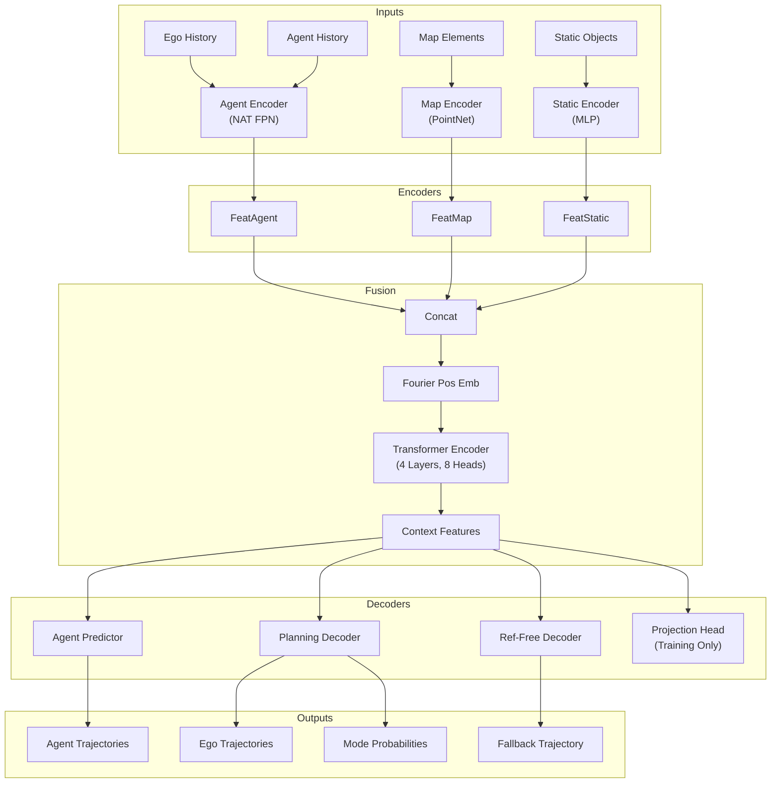
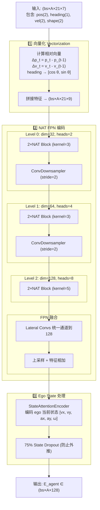

# PLUTO: Pushing the Limit of Imitation Learning-based Planning for Autonomous Driving

- **论文**：https://arxiv.org/abs/2404.14327
- **代码**：https://github.com/jchengai/pluto

> 核心方法：通过**辅助损失函数**（碰撞检测、轨迹预测）和**对比学习**（因果推理）强化传统模仿学习。采用 Transformer 融合车辆与地图特征，Query-based 解码器生成多模态轨迹。

---

## 一、背景概览

**基于模仿学习规划的三大挑战**

1. **多模态驾驶行为获取困难**：学习型规划器在纵向任务（车道跟随）上表现较好，但横向任务（变道、绕障）效果不佳
2. **纯模仿学习的固有局限**：包括学习捷径(shortcuts)、分布偏移(distribution shift)、因果混淆(causal confusion)
3. **开环训练与闭环测试的差距**：误差随时间累积导致输入数据偏离训练分布

**核心思想**：通过**辅助损失**和**对比学习**强化传统模仿学习，让模型学习真正的因果关系而非统计相关性。

**关键创新**：
1. **分解式Query架构**：将驾驶行为分解为横向（参考线）和纵向（模态）查询，通过分解式注意力降低计算复杂度
2. **可微碰撞损失**：基于ESDF（欧氏符号距离场）实现可微碰撞惩罚，直接优化轨迹安全性
3. **对比模仿学习（CIL）**：构造"反事实"样本（如红灯变绿灯、删除前车），用Triplet Loss学习场景因果结构


---

## 二、核心创新点

### 2.1 纵向-横向感知的 Query 式模型架构

- 采用 DETR-like 的 Query-based 架构
- 将驾驶行为分解为横向查询（基于参考线）和纵向查询（可学习嵌入）
- 通过分解式自注意力融合横向与纵向信息，计算复杂度从 $O(N_R^2 N_L^2)$ 降至 $O(N_R^2 N_L + N_R N_L^2)$

### 2.2 可微辅助损失

| 损失类型 | 作用 |
|---------|------|
| **Collision Loss** | 利用 ESDF 实现可微碰撞惩罚，直接优化轨迹安全性 |
| **Prediction Loss** | 强制 Encoder 预测周围车辆的未来轨迹，增强动态环境理解 |
| **Ref-free Loss** | 无车道线场景下的 Fallback 机制 |

### 2.3 对比模仿学习框架（CIL）

通过数据增强构造"反事实"样本（如红灯变绿灯、删除前车），利用 Triplet Loss 迫使模型学习场景中的**因果关系**，而非简单的统计相关性。

---

## 三、模型架构

### 3.1 整体架构图



### 3.2 数据流维度变化

| 阶段 | 模块 | 输入维度 | 输出维度 | 说明 |
|:---|:---|:---|:---|:---|
| **Input** | Feature Builder | Raw Data | $(bs, A, T_H, 7)$, $(bs, P, N_{pts}, 2)$ | A=Agent数, P=Map元素数 |
| **Encoding** | Agent Encoder | $(bs, A, T_H, C)$ | $(bs, A, D)$ | 提取历史特征 |
| | Map Encoder | $(bs, P, N_{pts}, C)$ | $(bs, P, D)$ | 提取地图特征 |
| | Static Encoder | $(bs, S, C)$ | $(bs, S, D)$ | 提取静态物特征 |
| **Fusion** | Concat | Three Features | $(bs, A+P+S, D)$ | 拼接所有 Token |
| | Transformer | $(bs, N_{tokens}, D)$ | $(bs, N_{tokens}, D)$ | 全局交互 |
| **Decoding** | Agent Predictor | $(bs, A-1, D)$ | $(bs, A-1, T_F, 6)$ | 预测其他车辆 |
| | Planning Decoder | $(bs, R, M, D)$ | $(bs, R, M, T_F, 4)$ | R=参考线数, M=模态数 |
| | Projection Head | $(bs, D)$ | $(bs, D)$ | 对比学习特征映射 |

> 其中：$T_H=21$ (2.1s历史), $T_F=80$ (8s预测), $D=128$

---

## 四、模块详解

### 4.1 Agent Encoder（NAT FPN）

对历史轨迹进行编码，输出每个 Agent 的特征表示。

#### 架构流程



#### 维度变化表

| 步骤 | 操作 | 输入维度 | 输出维度 |
|------|------|----------|----------|
| 1. Vectorization | `to_vector()` | $(bs, A, 21, 7)$ | $(bs, A, 21, 9)$ |
| 2. Reshape | `reshape` | $(bs, A, 21, 9)$ | $(bs \cdot A, 21, 9)$ |
| 3. NAT L0 | `2×NAT Block` | $(bs \cdot A, 21, 32)$ | $(bs \cdot A, 21, 32)$ |
| 4. Downsample | `stride=2` | $(bs \cdot A, 21, 32)$ | $(bs \cdot A, 10, 64)$ |
| 5. NAT L1 | `2×NAT Block` | $(bs \cdot A, 10, 64)$ | $(bs \cdot A, 10, 64)$ |
| 6. Downsample | `stride=2` | $(bs \cdot A, 10, 64)$ | $(bs \cdot A, 5, 128)$ |
| 7. NAT L2 | `2×NAT Block` | $(bs \cdot A, 5, 128)$ | $(bs \cdot A, 5, 128)$ |
| 8. FPN Fusion | `lateral+upsample` | 3层特征 | $(bs \cdot A, 128, 21)$ |
| 9. 取最后时间步 | `[:, :, -1]` | $(bs \cdot A, 128, 21)$ | $(bs \cdot A, 128)$ |
| 10. Ego State | `replace` | $(bs, 5)$ | $(bs, 128)$ |

#### 关键设计

1. **向量化 (Vectorization)**：将绝对坐标转换为相对向量 $\Delta p_t = p_t - p_{t-1}$，增强平移不变性

2. **NAT 替代标准 Transformer**：局部注意力窗口（kernel size=3/5），复杂度从 $O(T^2)$ 降到 $O(T \cdot K)$

3. **FPN 多尺度融合**：L0 捕捉短期运动，L2 捕捉长期趋势；自顶向下路径增强低层特征的语义信息

4. **State Dropout (75%)**：训练时丢弃加速度和角速度，防止模型通过运动学公式外推

### 4.2 Map Encoder（PointNet-like）

编码地图折线特征。

**输入特征**：每个折线点的8维特征
$$[p_i - p_0, \quad p_i - p_{i-1}, \quad p_i - p_i^{left}, \quad p_i - p_i^{right}]$$

| 特征 | 维度 | 含义 |
|---|---|---|
| $p_i - p_0$ | 2 | 相对折线起点的位置 |
| $p_i - p_{i-1}$ | 2 | 相对前一点的位移（局部方向） |
| $p_i - p_i^{left}$ | 2 | 到左边界的向量 |
| $p_i - p_i^{right}$ | 2 | 到右边界的向量 |

**编码过程**：
$$f_{point} = \text{MLP}(M_{raw}) \in \mathbb{R}^{P \times N_{pts} \times D}$$
$$E_{map} = \max_{n=1}^{N_{pts}} (f_{point}) \in \mathbb{R}^{P \times D}$$

### 4.3 Planning Decoder（分解式注意力）

#### Query 构造

- **横向 Query（Lateral）**：基于参考线编码，维度 $(N_R \times D)$
- **纵向 Query（Longitudinal）**：可学习嵌入，维度 $(N_L \times D)$，$N_L=12$
- **融合**：$Q_0 = \text{Proj}([Q_{lat}, Q_{lon}]) \in \mathbb{R}^{R \times M \times D}$

#### 分解式注意力层

计算复杂度从 $O((R \cdot M)^2)$ 降至 $O(R^2 M + R M^2)$：

1. **R2R Attention（横向）**：跨参考线交互
   - Input: $(B \cdot M, R, D)$
   - 对每个纵向模态，在 R 条参考线间做 attention

2. **M2M Attention（纵向）**：跨模态交互
   - Input: $(B \cdot R, M, D)$
   - 对每条参考线，在 M 个模态间做 attention

3. **Cross Attention（全局）**：与场景 Context 交互
   - Query: $(B, R \cdot M, D)$
   - Key/Value: $E_{context}$

**输出**：
- **轨迹**：$\text{MLP}(Q_{out}) \rightarrow (B, R, M, T_F, 4)$，每点4通道 $[x, y, \cos\theta, \sin\theta]$
- **概率**：$\text{MLP}(Q_{out}) \rightarrow (B, R, M)$

### 4.4 Projection Head（对比学习）

2层 MLP，仅训练时使用：

$$z = W_2 \cdot \text{ReLU}(W_1 \cdot h_{ego} + b_1) + b_2$$

- **输入**：Encoder 输出的 ego token $h_{ego} \in \mathbb{R}^{bs \times D}$
- **输出**：对比学习空间表示 $z \in \mathbb{R}^{bs \times D}$
- **参数量**：$2 \times D^2 \approx 33K$（$D=128$）

---

## 五、损失函数

### 5.1 总损失公式

$$\mathcal{L}_{total} = \mathcal{L}_{reg} + \mathcal{L}_{cls} + \mathcal{L}_{pred} + \mathcal{L}_{coll} + \mathcal{L}_{cont} + \mathcal{L}_{ref\_free}$$

所有权重均为 1.0。

### 5.2 各损失详解

#### (1) Ego Regression Loss（$\mathcal{L}_{reg}$）

监督最优轨迹与 GT 的位置、朝向匹配。

- **匹配机制**：通过 endpoint 投影到参考线确定 target query（Teacher Forcing）
- **损失函数**：Smooth L1 Loss
- **输入**：`best_trajectory` $(bs, T, 4)$，`target` $(bs, T, 6)$

$$\mathcal{L}_{reg} = \text{SmoothL1}(\hat{\tau}, \tau^{gt})$$

#### (2) Ego Classification Loss（$\mathcal{L}_{cls}$）

监督模型为正确的 mode 分配高置信度。

- **损失函数**：Cross Entropy Loss
- **输入**：`probability` $(bs, R, M)$，target 为 one-hot

$$\mathcal{L}_{cls} = \text{CrossEntropy}(\pi_0, \pi_0^*)$$

#### (3) Prediction Loss（$\mathcal{L}_{pred}$）

监督其他车辆的未来轨迹预测。

- **设计**：单模态预测（论文 ablation 显示与多模态差异 <1%）
- **作用**：为 encoder 提供 dense supervision；预测结果用于后处理 TTC 计算

$$\mathcal{L}_{pred} = \text{SmoothL1}(P_{1:N_A}, P_{1:N_A}^{gt})$$

#### (4) Collision Loss（$\mathcal{L}_{coll}$）

基于 ESDF 的可微碰撞损失。

**核心公式**：
$$\mathcal{L}_{coll} = \frac{1}{T_f} \sum_{t=1}^{T_f} \sum_{i=1}^{N_c} \max(0, R_c + \epsilon - d_i^t)$$

- $R_c$：覆盖圆半径（车辆用 $N_c=3$ 个圆覆盖）
- $\epsilon$：安全阈值（0.5m）
- $d_i^t$：通过双线性插值从 ESDF 查询的距离值

**优势**：相比 rasterization 内存效率高 100x+，支持 batch 并行。

#### (5) Contrastive Loss（$\mathcal{L}_{cont}$）

Triplet 对比损失，学习因果关系。

**损失公式**：
$$\mathcal{L}_{cont} = -\log \frac{\exp(s^+ / \tau)}{\exp(s^+ / \tau) + \exp(s^- / \tau)}$$

其中 $s^+ = \hat{z}^T \hat{z}^+$，$s^- = \hat{z}^T \hat{z}^-$，$\tau=0.1$。

**梯度流分析**：
- Anchor 特征同时参与 $s^+$ 和 $s^-$ 计算，梯度从两条路径汇总
- PyTorch 自动微分正确处理所有依赖关系

#### (6) Ref-free Regression Loss（$\mathcal{L}_{ref\_free}$）

无参考线场景（如停车场）的辅助损失。

---

## 六、对比模仿学习（CIL）

### 6.1 数据增强架构

```
原始样本(x) ──┬──> 正样本生成器(T+) ──> x+ (保留GT有效性)
              │
              └──> 负样本生成器(T-) ──> x- (破坏因果结构)

         ↓ Encoder ↓

    [h, h+, h-] ──> Projection ──> [z, z+, z-]
                          ↓
                Triplet Contrastive Loss
```

### 6.2 增强方法汇总

| 增强类型 | 方法 | 描述 | 触发概率 |
|---------|------|------|---------|
| **$T^+$** | State Perturbation | 对 AV 的位置、速度、加速度添加小随机扰动 | 100% |
| **$T^+$** | Non-interactive Dropout | 移除不与 AV 交互的 Agent | 50% |
| **$T^-$** | Traffic Light Inversion | 翻转交叉口交通灯状态 | 条件触发 |
| **$T^-$** | Interacting Agent Dropout | 移除与 AV 直接或间接交互的 Agent | 条件触发 |
| **$T^-$** | Leading Agent Insertion | 在 AV 轨迹前方插入车辆 | 条件触发 |

### 6.3 正样本增强详解

#### State Perturbation

```python
noise = UniformNoise(low, high).sample()  # 7维噪声
new_state = current_state + noise * scale

# 噪声范围
low  = [-1.0, -0.75, -0.35, -1, -0.5, -0.2, -0.1]
high = [1.0,  0.75,  0.35,  1,  0.5,  0.2,  0.1]
#      x(m)  y(m)   yaw    v   acc   δ    δ_rate
```

- 最多尝试5次，每次失败 scale 减半
- 碰撞检测通过后同步更新 Cost Map

#### Non-interactive Dropout

- 保护列表：Ego 车辆、Leading agents、Interactive agents
- Drop 比例：随机 10%-100%

### 6.4 负样本增强详解

#### 选择逻辑

```python
if not is_waiting_for_red_light:
    if has_leading_or_interacting_agents:
        available.append(neg_interacting_agent_dropout)

if is_waiting_for_red_light:
    available.append(neg_traffic_light_inversion)

if has_free_path_points and num_agents > 1:
    available.append(neg_leading_agent_insertion)

# 随机选择一种
generator = np.random.choice(available)
```

#### Traffic Light Inversion

- **触发条件**：Ego 正在等待红灯且前方无 leading vehicle
- **操作**：随机改为绿灯或未知
- **目的**：学习红绿灯的因果作用

#### Leading Agent Insertion

**插入流程**：
1. 从 free_path_points 随机选择插入点
2. 选择速度最接近 ego 的模板车辆
3. 缩放轨迹匹配速度、旋转平移对齐
4. 拼接到场景

```python
scale_coeff = v_ego / v_template * np.random.uniform(0, 0.8)
new_position = (scaled_traj - old_center) @ R + new_center
```

---

## 七、推理与后处理

### 7.1 轨迹选择算法

```
输入: 初始状态 y_0, 场景特征 x, 常数 K=20, α=0.3

1. T_0, π_0, P_{1:N_A} = PLUTO(x)          // 模型推理
2. T_0 = TopK(T_0, π_0, K)                  // 选择 Top-K 轨迹
3. 初始化 rollouts: T̃_0 = [y_0]
4. for t in 1...N_T:                        // 前向仿真
       u_0 = LQRTracker(y_0, T_0, t)
       y_0 = BicycleModel(y_0, u_0)
       T̃_0 = [T̃_0, y_0]
5. π_rule = RuleBasedEvaluator(T̃_0, P_{1:N_A}, x)
6. τ* = T_0[i], i = argmax(π_rule + α·π_0)  // 融合分数选择
7. return τ*
```

### 7.2 最终分数融合

$$\pi = \pi_{rule} + \alpha \cdot \pi_{model}$$

- $\alpha = 0.3$（论文 ablation 最优值）
- 规则评估包含：Progress、Comfort、TTC、Collision 等

---

## 八、训练配置

### 8.1 核心参数

| 参数 | 符号 | 值 |
|------|------|---|
| 历史时间步 | $T_H$ | 21 (2.1s) |
| 未来时间步 | $T_F$ | 80 (8s) |
| 隐藏维度 | $D$ | 128 |
| 编码器层数 | $L_{enc}$ | 4 |
| 解码器层数 | $L_{dec}$ | 4 |
| 纵向查询数 | $N_L$ | 12 |
| 覆盖圆数 | $N_c$ | 3 |
| 温度参数 | $\tau$ | 0.1 |
| 分数权重 | $\alpha$ | 0.3 |

### 8.2 训练设置

| 配置项 | 设置 |
|--------|------|
| GPU | 4 × RTX3090 |
| Batch Size | 128（CIL 开启后实际 384） |
| Epochs | 25 |
| Optimizer | AdamW |
| 学习率 | 前3轮 warmup 至 $1 \times 10^{-3}$，后余弦衰减 |
| Weight Decay | $1 \times 10^{-4}$ |
| 训练时间 | 45h（含 CIL）/ 22h（不含 CIL） |

### 8.3 模型参数量

| 模块 | 参数量 |
|------|--------|
| AgentEncoder (NAT) | ~400K |
| MapEncoder | ~100K |
| StaticEncoder | ~20K |
| Transformer Encoder (4层) | ~800K |
| PlanningDecoder | ~1.06M |
| AgentPredictor | ~155K |
| Projection Head | ~33K |
| **总计** | **~2.6M** |

---

## 九、实验结果

### 9.1 与 SOTA 方法对比

| 类型 | 方法 | Score | Collisions | TTC | Drivable | Progress | R-score |
|---|---|---|---|---|---|---|---|
| Expert | Log-Replay | 93.68 | 98.76 | 94.40 | 98.07 | 98.99 | 81.24 |
| Rule-based | PDM-Closed | 93.08 | 98.07 | 93.30 | **99.82** | 92.13 | 93.20 |
| Pure Learning | PlanTF | 85.30 | 94.13 | 90.73 | 96.79 | 89.83 | 77.07 |
| Pure Learning | **PLUTO†** | 89.04 | 96.18 | 93.28 | 98.53 | 89.56 | 80.01 |
| Hybrid | **PLUTO** | **93.21** | **98.30** | **94.04** | 99.72 | **93.65** | **92.06** |

> PLUTO 首次超越规则基方法 PDM-Closed，性能接近专家 Log-Replay

### 9.2 消融实验

| 模型 | 描述 | Score | Collisions | TTC | Drivable |
|---|---|---|---|---|---|
| $\mathcal{M}_0$ | Base | 87.04 | 95.92 | 91.43 | 95.92 |
| $\mathcal{M}_1$ | +SDE | 89.64 | 97.37 | 95.14 | 97.57 |
| $\mathcal{M}_2$ | +Auxiliary loss | 90.03 | 97.98 | 93.52 | 98.38 |
| $\mathcal{M}_3$ | +Ref. free head | 90.69 | 97.57 | 94.74 | 99.19 |
| $\mathcal{M}_4$ | +CIL | 91.66 | 97.59 | 94.38 | 99.60 |
| $\mathcal{M}_5$ | +Post-processing | **93.57** | **98.39** | **95.58** | 99.60 |

---

## 十、局限性与未来方向

1. **单模态预测**：当前对每个动态 Agent 仅预测单一轨迹，未来可探索联合多模态预测
2. **后处理依赖**：后处理无法处理所有生成轨迹均不可用的情况，可考虑将其转为影响轨迹生成的中间角色

---

## 附录

### A. 关键代码位置

| 功能 | 文件位置 |
|------|---------|
| 总损失计算 | `pluto_trainer.py:110-204` |
| Ego 规划损失 | `pluto_trainer.py:219-267` |
| 对比损失 | `pluto_trainer.py:269-310` |
| 碰撞损失 | `loss/esdf_collision_loss.py` |
| 数据增强 | `data_augmentation/contrastive_scenario_generator.py` |

### B. 参考文献

- **论文**：Cheng et al. "PLUTO: Pushing the Limit of Imitation Learning-based Planning for Autonomous Driving", arXiv:2404.14327, 2024
