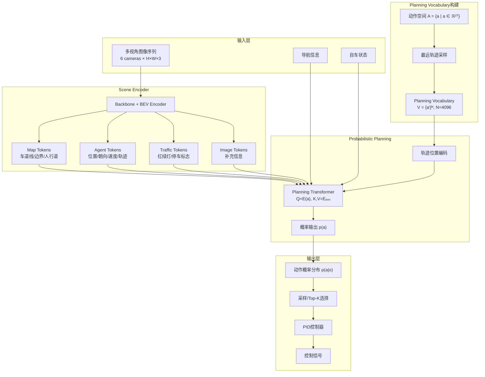
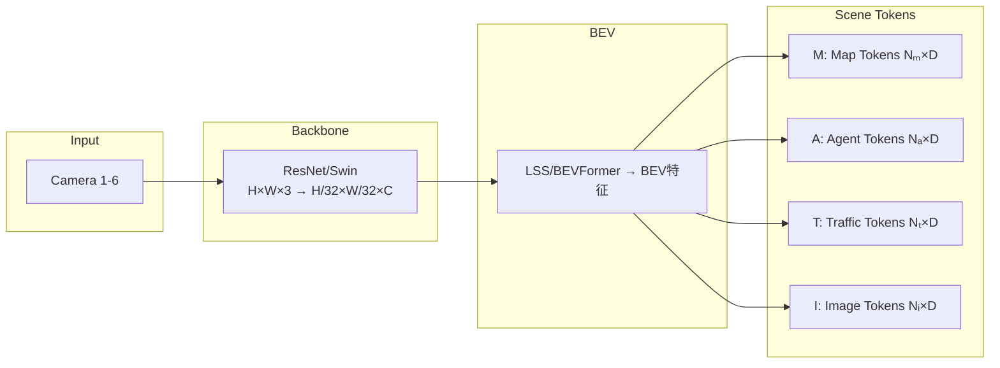
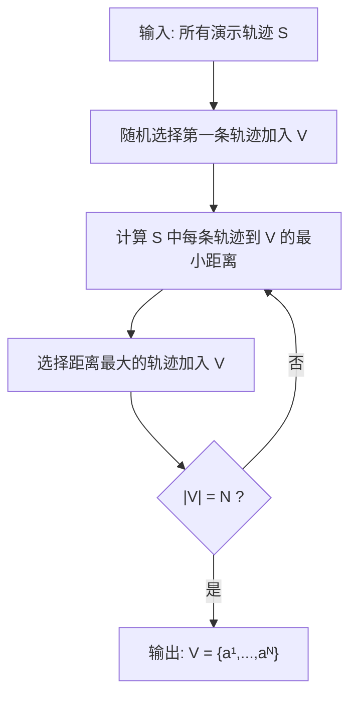
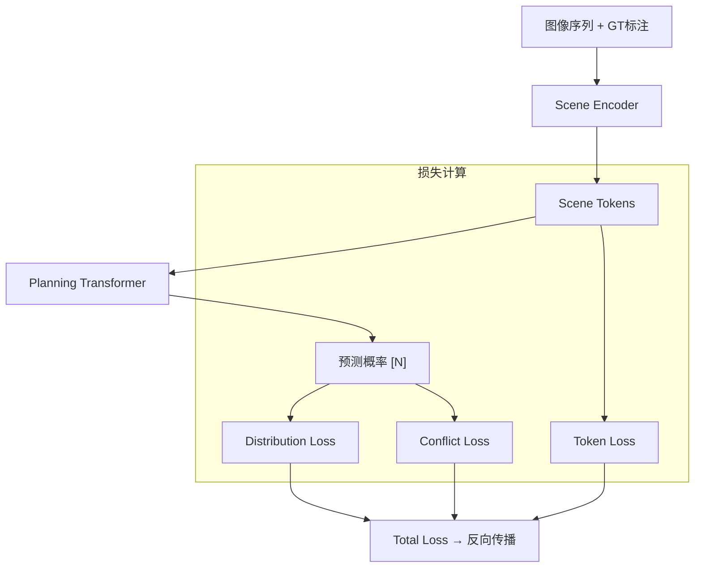
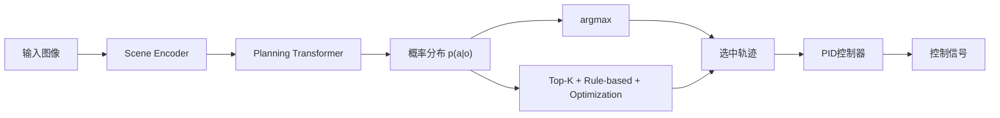

# VADv2: End-to-End Vectorized Autonomous Driving via Probabilistic Planning

- **代码**：https://github.com/yuzhe-yang/VADv2
- **论文**：https://arxiv.org/abs/2402.13243

## 一、概览

**核心问题**：传统确定性规划直接回归单一轨迹，在**多模态驾驶场景**（如跟车/变道/让行等多种可行选择）中容易输出"折中"的危险轨迹。

**核心思想**：将规划建模为**概率分布** $p(a|o)$ 而非确定性回归，类似LLM预测下一个token的概率分布。

**关键创新**：
1. **Planning Vocabulary**：从真实驾驶数据中采样4096条代表性轨迹，通过最远轨迹采样保证覆盖度
2. **概率场建模**：借鉴NeRF的位置编码，将轨迹坐标映射到高维空间，用Transformer预测每条候选轨迹的概率
3. **多重监督**：KL散度学习专家分布 + Conflict Loss注入碰撞/越界等驾驶先验


## 二、为什么需要概率规划？

驾驶场景天然具有多模态特性：跟车时可以继续跟车(40%)、变道超车(40%)或其他(20%)；与来车交互时可以让行(25%)或超车(25%)等。

**确定性规划的问题**：
- 直接回归单一目标轨迹，假设环境与动作存在确定性关系
- 当可行解空间**非凸**时，输出"折中"的危险轨迹
- 倾向于输出训练数据中的主导轨迹（如停车、直行）

---

## 三、整体架构



---

## 四、核心模块详解

### 4.1 Scene Encoder



**四类Token**：

|Token类型|数量|预测目标|监督信号|
|---|---|---|---|
|Map Token|~100|车道中心线、边界、人行横道|l1 loss + focal loss|
|Agent Token|~50|车辆位置/朝向/尺寸/速度/轨迹|检测loss + motion loss|
|Traffic Token|~10|红绿灯状态、停车标志|focal loss|
|Image Token|~256|补充视觉信息|无直接监督|

> **联合训练而非单独训练**：Scene Tokens 需要显式编码高层语义信息，端到端训练让感知特征对规划任务最优化。

---

### 4.2 Planning Vocabulary

**核心思想**：将连续动作空间离散化为 N=4096 条代表性轨迹。

**动作表示**：
$$a = (x_1, y_1, x_2, y_2, \ldots, x_T, y_T) \in \mathbb{R}^{2T}$$

**最远轨迹采样（Furthest Trajectory Sampling）**：

算法目标是最大化动作空间覆盖率，保留稀有但重要的驾驶行为（如紧急避让），避免高频动作（如直行）过度占据样本。



**轨迹到集合的距离**：$d(\tau, \mathcal{V}) = \min_{v \in \mathcal{V}} d(\tau, v)$，两条轨迹间通常用展平后的L2距离。

```python
def furthest_trajectory_sampling(all_trajectories, N=4096):
    V = [random.choice(all_trajectories)]
    while len(V) < N:
        max_dist, best_traj = -1, None
        for traj in all_trajectories:
            min_dist_to_V = min([np.linalg.norm(traj.flatten() - v.flatten()) for v in V])
            if min_dist_to_V > max_dist:
                max_dist, best_traj = min_dist_to_V, traj
        V.append(best_traj)
    return V
```

**优势**：每条轨迹采样自真实驾驶数据，天然满足车辆运动学约束。

---

### 4.3 Probabilistic Planning

#### 位置编码（借鉴NeRF）

将轨迹坐标映射到高维嵌入空间：

$$E(a) = \text{Cat}\left[\Gamma(x_1), \Gamma(y_1), \ldots, \Gamma(x_T), \Gamma(y_T)\right]$$

$$\Gamma(pos) = \text{Cat}\left[\gamma(pos, 0), \ldots, \gamma(pos, L-1)\right]$$

$$\gamma(pos, j) = \text{Cat}\left[\cos\left(\frac{pos}{10000^{2\pi j/L}}\right), \sin\left(\frac{pos}{10000^{2\pi j/L}}\right)\right]$$

**维度变化**：单坐标 $pos \in \mathbb{R}$ → $\Gamma(pos) \in \mathbb{R}^{2L}$ → 完整轨迹 $E(a) \in \mathbb{R}^{4TL}$

#### Planning Transformer

- **Query**: Planning Tokens $E(a)$, shape: [N, D] (N=4096)
- **Key/Value**: Scene Tokens $E_{env}$, shape: [$N_s$, D]
- **输出**: 每个候选轨迹的概率 $p(a^i)$

$$p(a) = \text{MLP}\left(\text{Transformer}(E(a), E_{env}) + E_{navi} + E_{state}\right)$$

---

## 五、训练

### 总损失函数

$$\mathcal{L} = \mathcal{L}_{distribution} + \mathcal{L}_{conflict} + \mathcal{L}_{token}$$

### Distribution Loss

用KL散度监督模型预测分布逼近目标分布：

$$\mathcal{L}_{distribution} = D_{KL}(p_{data} \| p_{pred})$$

**目标分布构建**：GT轨迹高概率，其他轨迹根据与GT的距离分配权重（距离越近惩罚越小），这是一种**软监督**。

```python
def compute_distribution_loss(pred_logits, gt_trajectory, vocabulary, temperature=1.0):
    distances = torch.norm(vocabulary - gt_trajectory, dim=(1,2))
    target_dist = F.softmax(-distances / temperature, dim=0)  # 距离小→概率高
    pred_dist = F.softmax(pred_logits, dim=0)
    return F.kl_div(pred_dist.log(), target_dist, reduction='batchmean')
```

### Conflict Loss

额外的场景约束，让冲突轨迹概率趋近于0：

```python
def compute_conflict_loss(pred_probs, vocabulary, scene_info):
    conflict_mask = []
    for traj in vocabulary:
        collide = check_collision(traj, scene_info['agent_futures'])
        out_of_road = check_boundary(traj, scene_info['road_boundary'])
        conflict_mask.append(collide or out_of_road)
    return -torch.log(1 - pred_probs[conflict_mask] + 1e-8).mean()
```

### Scene Token Loss

$$\mathcal{L}_{token} = \mathcal{L}_{map} + \mathcal{L}_{agent} + \mathcal{L}_{traffic}$$

|Token|监督目标|Loss类型|
|---|---|---|
|Map|车道线、边界等几何结构|l1 + focal|
|Agent|车辆检测 + 多模态轨迹预测|l1 + focal + minFDE|
|Traffic|红绿灯状态、停车标志|focal|

### 训练流程



---

## 六、推理



**推理灵活性**：
1. **简单模式**：选概率最高的轨迹
2. **鲁棒模式**：Top-K采样 → Rule-based过滤 → Optimization精修
3. **置信度判断**：概率值可作为切换传统PnC与学习PnC的依据

---

## 七、实验

### 数据配置

|配置项|数值|
|---|---|
|训练数据量|~300万帧|
|采样频率|2 Hz|
|相机数量|6个环视相机|
|训练Town|Town03, 04, 06, 07, 10|
|测试Town|Town05|
|词汇表大小|4096|

### 性能对比（Town05 Long）

|方法|模态|Driving Score ↑|Route Completion ↑|
|---|---|---|---|
|DriveMLM|C+L|76.1|98.1|
|DriveAdapter+TCP|C+L|71.9|97.3|
|ThinkTwice|C+L|70.9|95.5|
|Interfuser|C|68.3|95.0|
|**VADv2**|**C**|**85.1**|**98.4**|

> 仅用相机传感器，超越所有Camera+LiDAR方法。

---

## 八、创新点

1. **概率规划范式**：将规划建模为 $p(a|o)$ 而非确定性回归，能处理非凸解空间
2. **Planning Vocabulary**：离散化连续动作空间为4096条轨迹，最远采样保证覆盖度，天然满足运动学约束
3. **概率场函数**：借鉴NeRF的位置编码，连续建模动作空间到概率的映射
4. **丰富监督信号**：Distribution Loss学习专家分布，Conflict Loss注入驾驶先验，所有候选都有监督
5. **推理灵活性**：输出多模态结果，易于与规则/优化方法结合，概率值可作为置信度

---

## 九、与LLM的类比

|语言模型|VADv2|
|---|---|
|词汇表 (Vocabulary)|规划词汇表 (Planning Vocabulary)|
|Token|轨迹 (Trajectory)|
|上下文 (Context)|环境观测 (Observation)|
|下一词分布 p(word\|context)|动作分布 p(a\|o)|
|采样/Beam Search|采样/Top-K + Rule-based|

---

## 十、局限性

1. 仅在CARLA仿真器验证，真实场景效果未知
2. 词汇表大小固定，可能限制泛化能力
	1. 思考：增加轻量生成式的轨迹作为候选？
3. 计算开销：需同时评估4096个候选轨迹的概率

---

## 总结

> **VADv2 = 场景Token编码 + 规划词汇表离散化 + 概率场建模 + KL散度监督**
> 
> 学习**分布**而非**单点回归**。